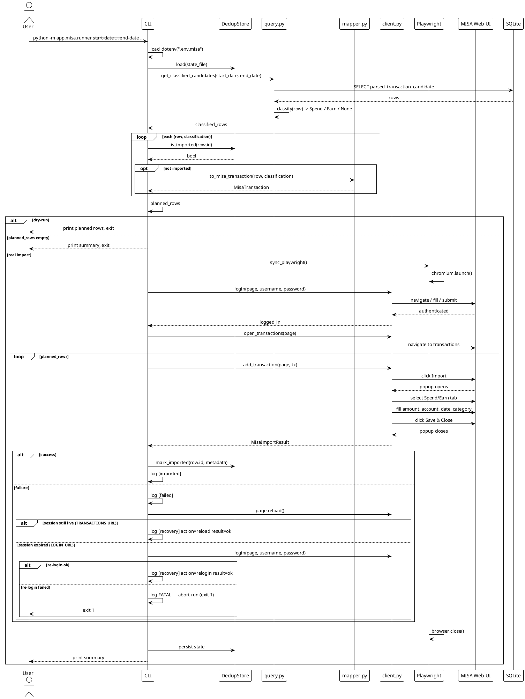
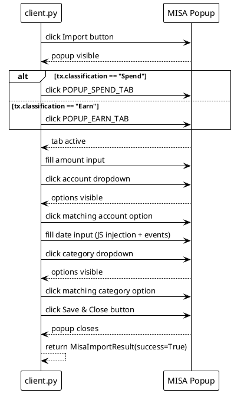

# MISA Money Keeper Import — Implementation Document

> Location: `app/misa/`  
> Entry point: `python -m app.misa.runner`  
> Companion docs:
> - [update_misa_requirements.md](./update_misa_requirements.md) — functional requirements
> - [update_misa_design.md](./update_misa_design.md) — original design (some details have evolved)

---

## 1. Objective

Provide a standalone, CLI-driven import pipeline that pushes already-parsed **Spend** and **Earn** transactions from `data/txdb.sqlite3` into [MISA Money Keeper](https://moneykeeperapp.misa.vn/management/transactions) via browser automation (Playwright), with:

- deterministic classification of which rows are importable,
- mapping of canonical account names to MISA dropdown labels,
- per-row duplicate protection using a local JSON state file,
- idempotent re-runs,
- dry-run support,
- per-row and summary logging.

Out of scope: modifying the FastAPI app, the Gmail poller/parser, or MISA account/category management inside the MISA UI.

---

## 2. High-Level Architecture

```
┌─────────────────┐     ┌──────────────────┐     ┌─────────────────────┐
│  data/txdb.     │────▶│  app/misa/query  │────▶│  app/misa/mapper    │
│  sqlite3        │     │  + classify()    │     │  to_misa_transaction│
└─────────────────┘     └──────────────────┘     └─────────────────────┘
                                                           │
                                                           ▼
┌─────────────────┐     ┌──────────────────┐     ┌─────────────────────┐
│  misa.storage_  │◀───▶│  app/misa/runner │────▶│  MisaTransaction    │
│  state.json     │     │  orchestration   │     │  dataclass          │
└─────────────────┘     └──────────────────┘     └─────────────────────┘
                                 │
                                 ▼
                        ┌──────────────────┐
                        │  app/misa/client │
                        │  Playwright      │
                        │  login / import  │
                        └──────────────────┘
                                 │
                                 ▼
                        ┌──────────────────┐
                        │  MISA web UI     │
                        └──────────────────┘
```

### 2.1 Component Responsibilities

| Component | File | Responsibility |
|-----------|------|----------------|
| **Runner** | `app/misa/runner.py` | CLI entrypoint. Loads `.env.misa`, plans rows, handles `--dry-run`, launches the browser loop, prints summary. |
| **Query** | `app/misa/query.py` | Queries `ParsedTransactionCandidate`, classifies rows as Spend/Earn or excluded, applies date filters. |
| **Mapper** | `app/misa/mapper.py` | Maps a candidate + classification to a `MisaTransaction` (amount, account, datetime, category). |
| **Dedup Store** | `app/misa/dedup_store.py` | JSON file read/write; tracks which candidate IDs have already been imported. |
| **Client** | `app/misa/client.py` | Playwright wrapper: login, session reuse, open transactions page, fill and save one transaction. |
| **Selectors** | `app/misa/selectors.py` | All CSS/text selectors for the MISA UI, grouped by Spend/Earn tab. |
| **Models** | `app/misa/models.py` | `MisaTransaction` dataclass and `MisaImportResult` named tuple. |

---

## 3. Sequence Diagram (PlantUML)

### 3.1 Full import run



### 3.2 Per-transaction save flow



---

## 4. Classification Logic

Implemented in `app/misa/query.py`.

A row is importable only if exactly one of `inferred_sender` / `inferred_receiver` is the literal string `"Other"`:

| inferred_sender | inferred_receiver | Classification | Meaning |
|-----------------|-------------------|----------------|---------|
| not `"Other"` | `"Other"` | **Spend** | Money left a known account to an unknown/merchant party. |
| `"Other"` | not `"Other"` | **Earn** | Money arrived into a known account from an unknown payer. |
| `"Other"` | `"Other"` | excluded | Both parties unknown — usually an unparsed email. |
| not `"Other"` | not `"Other"` | excluded | Both parties known — this is an internal-transfer leg, handled by the correlator, not imported individually. |

`debit_credit` and `type_info` are intentionally **not** used here; the parser already normalized accounts into the canonical alias map, so the presence/absence of `"Other"` is the deciding signal.

---

## 5. Field Mapping

Implemented in `app/misa/mapper.py`.

| `MisaTransaction` field | Spend source | Earn source |
|-------------------------|--------------|-------------|
| `amount` | `row.amount` | `row.amount` |
| `account` | `row.inferred_sender` | `row.inferred_receiver` |
| `datetime` | `row.datetime_sgt` formatted as `DD/MM/YYYY HH:MM` | same |
| `category` | `"Bars & Coffee"` | `"Balance"` |
| `classification` | `"Spend"` | `"Earn"` |

Account names are translated through `app/misa/mapper.py::MISA_ACCOUNT_NAME_MAP` before being matched against MISA dropdown options, e.g.:

```python
MISA_ACCOUNT_NAME_MAP = {
    "PayLah": "Ví PayLah",
    "DBS": "DBS Multiplier Account",
    "Trust": "Trust App",
    "ACB Online": "ACB Online",
    "ACB": "ACB",
}
```

---

## 6. Dedup State

Implemented in `app/misa/dedup_store.py`.

- Default file: `ai/update_misa_implementation/misa.storage_state.json`
- Schema: `{ "<candidate_id>": { "imported_at": "...", "amount": "...", "account": "...", "datetime": "...", "classification": "..." } }`
- Only successful imports are written. Failed rows remain eligible for retry on the next run.
- Written atomically (temp file + rename) to avoid corruption.

---

## 7. CLI Usage

Create credentials file `app/.env.misa` (gitignored):

```bash
MISA_USERNAME=your_username
MISA_PASSWORD=your_password
```

Dry-run to preview what would be imported:

```bash
python -m app.misa.runner --start-date 2026-07-17 --end-date 2026-07-17 --dry-run
```

Real import (headless):

```bash
python -m app.misa.runner --start-date 2026-07-17 --end-date 2026-07-17
```

Options:

| Option | Description |
|--------|-------------|
| `--start-date YYYY-MM-DD` | inclusive lower bound on `datetime_sgt` |
| `--end-date YYYY-MM-DD` | inclusive upper bound on `datetime_sgt` |
| `--state-file PATH` | custom dedup state JSON path |
| `--headed` | show the browser window |
| `--limit N` | import at most N rows |
| `--dry-run` | classify/map/print without browser or state changes |

---

## 8. Key Design Decisions

1. **Standalone CLI, not part of FastAPI** — the import is intentionally a manual, audited operation; it does not run automatically with every parsed email.
2. **Playwright over API** — MISA does not expose a public import API; browser automation is the only reliable channel.
3. **Spend/Earn selector split** — the MISA popup has separate tabs for income vs. expense, each with its own DOM inputs, so `selectors.py` uses a `_SPEND_` / `_EARN_` naming convention.
4. **Date injection via JS** — the Vue.js datepicker resets to today when `fill()` is used; the working approach sets the input value directly and dispatches `focus`, `input`, `change`, and `blur` events.
5. **Session reuse via `storage_state`** — after the first successful login, Playwright persists cookies/localStorage so subsequent runs skip credentials unless the session expires.
6. **SQLite by default** — the same `data/txdb.sqlite3` used by the rest of the app is read directly; no extra Postgres setup is required for the import step.

---

## 9. Testing

Test files under `tests/`:

| Test | Coverage |
|------|----------|
| `test_misa_query.py` | Classification rules and account mapping. |
| `test_misa_dedup.py` | State file read/write, retry semantics. |
| `test_misa_client.py` | Login and import flow against local HTML fixtures. |
| `test_misa_runner.py` | CLI args, dry-run output, credentials handling, limits. |

Run the MISA-specific tests:

```bash
python -m pytest tests/test_misa_*.py -v
```

---

## 10. Current Status

As of the latest implementation:

- Spend and Earn tab switching works.
- Account dropdown selection works for both tabs.
- Category option click works for both tabs.
- Save & Close closes the popup and the new row appears in the list.
- Date is filled correctly (no longer reset to today).
- Dedup store records `tx.datetime` in ISO format.
- Dry-run and real-import modes both operational.
- **Done (2026-09-02)**: Error recovery on import failure — `_recover_session()`
  helper added to `runner.py`; wired into `_run_import()` loop after every
  failed row. Page reload attempted first; re-login triggered if session expired;
  run aborted with exit code 1 if re-login fails. `[recovery]` log line emitted
  on every attempt. 4 new tests in `test_misa_runner.py`; all 53 tests pass.
