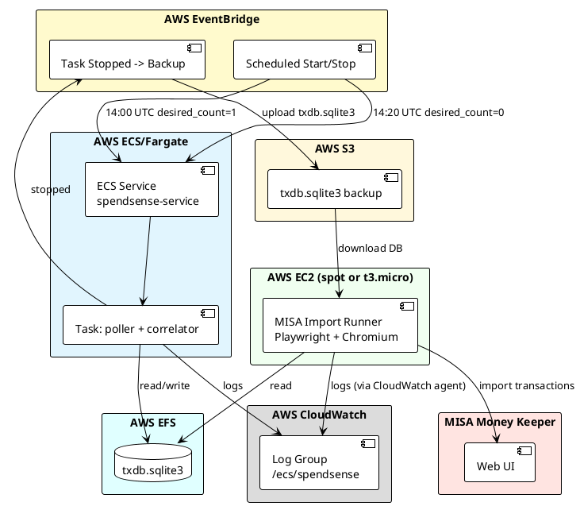
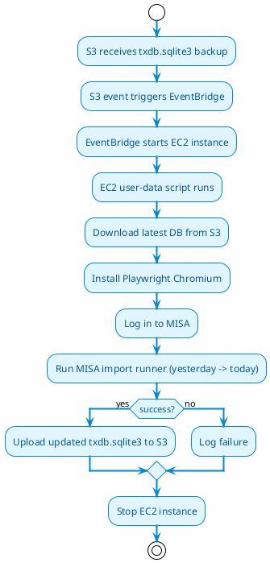

# Deployment Requirements — SpendSense AWS + MISA Import

> Scope: run the Gmail ingestion pipeline on AWS for ~15 minutes per day, then import newly parsed Spend/Earn transactions into MISA Money Keeper from an EC2 instance.

---

## 1. Goals and Constraints

### 1.1 Goals

1. Run the Gmail poller + correlator on AWS automatically each day.
2. Import new Spend/Earn transactions into MISA after ingestion finishes.
3. Avoid duplicate MISA imports across runs.
4. Keep logs in CloudWatch for debugging.
5. Minimize cost.

### 1.2 Constraints

- **Cost is the top priority**: no ALB, no NAT Gateway, no RDS unless proven necessary.
- **MISA import must use a real browser** because MISA has no public API. Playwright on ECS Fargate is possible only in headless mode and cannot handle interactive 2FA/captcha.
- **App runs only ~15 minutes per day**: use scheduled start/stop.
- **SQLite on EFS is acceptable** for this volume and duration.

---

## 2. Architecture Overview



---

## 3. ECS Task Requirements

### 3.1 What the task runs

The task has no API. It runs only:

1. **Poller worker** — fetches bank emails from Gmail, stores raw emails, and triggers parsing.
2. **Correlator worker** — matches debit/credit pairs into `InternalTransfer` events.

The parser runs synchronously inside the poller worker (`enqueue_for_parsing` calls `parse_email_task` directly). No separate parser container is needed.

### 3.2 Container command

The Docker image stays single. `APP_ROLE` selects the command at runtime:

| `APP_ROLE` | Command |
|------------|---------|
| `poller` | `python -m app.workers.poller_worker` |
| `correlator` | `python -m app.workers.correlator_worker` |
| `misa` | `python -m app.misa.runner ...` |

### 3.3 Init container

Before workers start, an init container must:

1. Mount EFS at `/app/data`.
2. Download `txdb.sqlite3` from S3 if the file is missing or empty.
3. Exit successfully so workers can start.

### 3.4 Backup on stop

When the ECS task stops, EventBridge triggers a one-off Fargate backup task that uploads `/app/data/txdb.sqlite3` to S3.

---

## 4. MISA Import Runner

### 4.1 Where it runs

**On a dedicated EC2 instance**, not on ECS.

Reasons:

- Playwright needs a desktop/browser environment. On Fargate only headless Chromium is available, and interactive login/2FA is impossible.
- The MISA import is a short daily job. A small EC2 instance (t3.micro or t3.small) started on schedule is cheaper and more reliable than maintaining a GUI-capable Fargate task.
- The EC2 instance can be stopped after the import completes to save cost.

### 4.2 When it runs

Triggered **after the ECS task has stopped** and the backup has been uploaded to S3.

Options:

| Approach | Pros | Cons |
|----------|------|------|
| A. EventBridge rule on S3 `PutObject` for `txdb.sqlite3` | Simple, reacts to actual backup completion | If backup takes time, runner may start before upload finishes (use S3 event, so this is fine) |
| B. Second EventBridge schedule ~5 minutes after ECS stop | Very simple, no coupling | Race condition if backup is slow |
| C. Lambda that waits for backup task success, then starts EC2 | Most reliable | Adds Lambda cost/complexity |

**Recommended: A** — S3 event notification on `PutObject` for `txdb.sqlite3` triggers an EventBridge rule that starts the EC2 instance.

### 4.3 EC2 lifecycle



### 4.4 State storage for MISA import

**Current design**: `imported_state.json` tracks which candidate IDs have been imported.

**Problem with S3-only state**: every run must download/upload the JSON file. That works but is fragile and adds S3 operations.

**Better design**: add a column to the SQLite database itself.

#### Proposed schema change

Add to `parsed_transaction_candidate`:

```python
misa_imported_at = Column(TIMESTAMP(timezone=True), nullable=True)
misa_import_status = Column(String, nullable=True)  # "imported" | "failed" | None
```

Or a separate table:

```python
class MisaImportState(Base):
    __tablename__ = "misa_import_state"

    parsed_candidate_id = Column(Uuid, ForeignKey("parsed_transaction_candidate.id"), primary_key=True)
    imported_at = Column(TIMESTAMP(timezone=True), nullable=False)
    amount = Column(Numeric(18, 2), nullable=True)
    account = Column(String, nullable=True)
    datetime = Column(String, nullable=True)
    classification = Column(String, nullable=True)
    status = Column(String, nullable=False, default="imported")
```

The separate table is cleaner because it avoids mutating the candidate row and keeps an audit trail.

The MISA runner queries this table to skip already-imported rows and writes new rows on success. No JSON file needed.

### 4.5 State sync between ECS and EC2

Because the state lives in SQLite:

1. ECS task writes parsed candidates and correlation results.
2. ECS task stops; backup task uploads `txdb.sqlite3` to S3.
3. EC2 instance downloads the same `txdb.sqlite3`.
4. MISA runner reads/writes `misa_import_state` in the same SQLite file.
5. EC2 instance uploads the updated `txdb.sqlite3` back to S3.
6. Next day, ECS restores the updated DB from S3.

This keeps the dedup state in one place and removes the need for a separate `imported_state.json` on S3.

### 4.6 MISA runner command on EC2

The EC2 instance runs the same Docker image with `APP_ROLE=misa`. The import date range is **yesterday to today** (inclusive):

```bash
START_DATE=$(date -d 'yesterday' +%Y-%m-%d)
END_DATE=$(date +%Y-%m-%d)

docker run --rm \
  -e APP_ROLE=misa \
  -e DATABASE_URL=sqlite:///./data/txdb.sqlite3 \
  -e MISA_USERNAME=... \
  -e MISA_PASSWORD=... \
  -v /mnt/data:/app/data \
  <ecr>/spend_sense:<tag> \
  python -m app.misa.runner --start-date "$START_DATE" --end-date "$END_DATE"
```

The MISA runner will log in fresh each day. No session persistence is required.

---

## 5. Docker Image Requirements

### 5.1 Single image for all roles

The same Docker image must support:

- Poller worker
- Correlator worker
- MISA runner
- Backup helper

### 5.2 Playwright browser installation

**Decision: download Chromium at runtime on EC2.**

To keep the Docker image small and avoid EBS cost, **do not install Playwright Chromium in the image**. The image only contains the Python code and dependencies.

Playwright browsers are installed on the EC2 instance at runtime, inside the container:

```bash
docker run --rm \
  -v /mnt/data:/app/data \
  <ecr>/spend_sense:<tag> \
  playwright install chromium
```

This keeps:
- ECR image small (~100 MB instead of ~1.5 GB),
- ECS task startup fast,
- EBS cost zero (no persistent volume needed for browsers).

The browser download (~150-200 MB) adds ~1-2 minutes to the EC2 run, which is acceptable for a daily job.

> Alternative considered: persist Chromium on an EBS volume. Rejected because EBS is billed 24/7 even when the instance is stopped, adding ~$0.72/month.

### 5.3 Command selection

The `CMD` in Dockerfile must switch on `APP_ROLE`:

```dockerfile
CMD ["sh", "-c", "\
  case \"$APP_ROLE\" in \
    poller) exec python -m app.workers.poller_worker ;; \
    correlator) exec python -m app.workers.correlator_worker ;; \
    misa) exec python -m app.misa.runner ;; \
    backup) exec /backup-script.sh ;; \
    *) echo \"Unknown APP_ROLE=$APP_ROLE\"; exit 1 ;; \
  esac"]
```

---

## 6. Logging Requirements

### 6.1 ECS logs

- Use `awslogs` log driver in ECS task definitions.
- All logs go to CloudWatch log group `/ecs/spendsense`.
- The existing `app/core/logging.py` already writes to stdout, so `awslogs` captures it.

### 6.2 EC2 logs

Option A: Run a CloudWatch agent on EC2 to forward `/var/log/spendsense.log` to CloudWatch.

Option B: Run MISA import via Docker with `awslogs` log driver. The EC2 instance needs IAM permission to create log streams.

**Recommended: B** — use Docker `awslogs` driver directly. Simpler, no agent installation.

```bash
docker run --rm \
  --log-driver=awslogs \
  --log-opt awslogs-region=ap-southeast-1 \
  --log-opt awslogs-group=/ecs/spendsense-misa \
  --log-opt awslogs-stream-prefix=misa \
  ...
```

---

## 7. Cost Optimization

| Resource | Optimization |
|----------|--------------|
| ECS Fargate | Run only 15 min/day via scheduled scaling. Use Fargate Spot if supported in your region. |
| EFS | Use EFS Lifecycle Management to move old backups to IA. Keep only the latest backup in S3 Standard. |
| EC2 | Use t3.micro with scheduled start/stop, or t3.micro Spot. Stop after MISA import completes. |
| S3 | Use Intelligent-Tiering or Standard-IA for backups. Versioning can be disabled. |
| ECR | Keep image small (no browsers). Add lifecycle policy to keep only last 30 images. |
| Secrets Manager | Two secrets are fine; cost is negligible. |
| Playwright browsers | Install at runtime on EC2, not baked into image. |

---

## 8. Open Questions / Clarifications

1. **EC2 OS**: Amazon Linux 2023 or Ubuntu? Amazon Linux fits better with SSM and Docker.
2. **Imported state**: do you prefer the column on `parsed_transaction_candidate` or a separate `misa_import_state` table? A separate table is recommended.
3. **Failure handling**: if MISA import fails for one row, should the EC2 instance stop anyway? Yes, but the failed rows remain unmarked and will be retried next run.
4. **Backup timing**: should the EC2 upload the updated DB back to S3 immediately after import, or only on success? Only on success avoids corrupting the backup with a half-imported state.

---

## 9. Implementation Order

1. Add `misa_import_state` table (Alembic migration + model).
2. Update `app/misa/runner.py` to read/write DB state instead of JSON.
3. Update `Dockerfile` to support `APP_ROLE=poller|correlator|misa`. Do not install Chromium in the image.
4. Fix `deploy_1/main.tf` ECS task to run poller + correlator containers.
5. Add S3 event → EventBridge → EC2 start automation.
6. Create EC2 user-data script that pulls image, installs Chromium, downloads DB, runs MISA import, uploads DB, stops instance.
7. Add CloudWatch log group for MISA runner.
