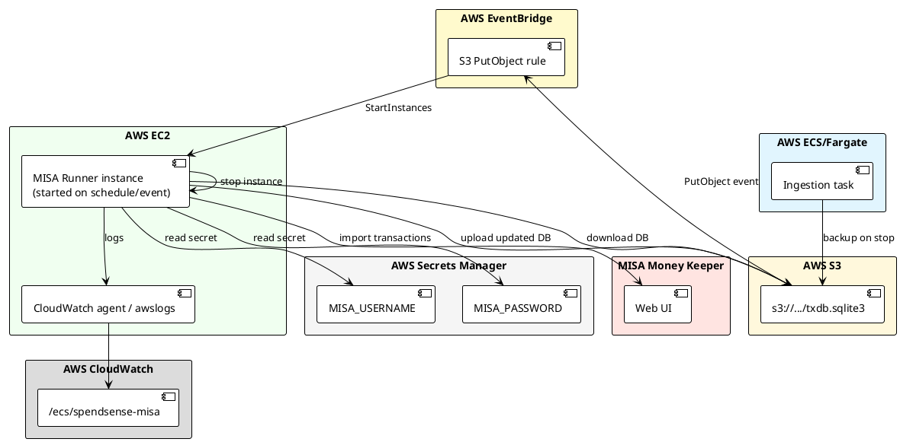

# Design: Deploy the MISA Import Runner on AWS

> Companion to [misa_deployment_tasks.md](./misa_deployment_tasks.md).
> Builds on the automation design in [update_misa_design.md](./update_misa_design.md)
> and the cost/security constraints in [deployment_requirements.md](./deployment_requirements.md).

## 1. Objective

Run the `app.misa.runner` import job automatically each day after the Gmail
ingestion pipeline finishes, importing the previous day's Spend/Earn
transactions into MISA Money Keeper via Playwright.

The MISA import must:
- Start only after the latest `txdb.sqlite3` has been backed up to S3.
- Re-use the same SQLite database so `misa_import_state` dedup state survives.
- Keep MISA credentials out of the repository.
- Cost no more than necessary (no always-on compute, no ALB, no NAT Gateway).

## 2. Scope

In scope:
- Triggering the MISA runner after the daily ECS backup completes.
- EC2 instance that downloads the DB, runs the import, uploads the updated DB,
  then stops itself.
- IAM, security group, logging, and secret storage for the EC2 runner.
- Dockerfile `APP_ROLE=misa` command.
- Terraform for the EC2 runner, EventBridge rule, and supporting resources.

Out of scope:
- Changes to the MISA automation logic itself (covered by update_misa_tasks.md).
- The ECS poller/correlator task architecture (covered by deployment_requirements.md
  and aws_deployment_recommendations.md).

## 3. Architecture Overview



## 4. Component Design

### 4.1 Trigger: S3 event → EventBridge → EC2 start

The MISA runner must not start until the updated `txdb.sqlite3` is available in
S3. The cleanest coupling is an S3 event notification on the backup bucket:

1. S3 emits an `ObjectCreated:PutObject` event for `txdb.sqlite3`.
2. EventBridge rule matches the event.
3. EventBridge target calls `ec2:StartInstances` for the dedicated MISA runner
   instance.
4. If the instance is already running, `StartInstances` is idempotent and
   returns success without side effects.

Alternative (EventBridge schedule 5 minutes after ECS stop) was rejected
because it races the backup task and may start the runner before the new DB is
ready.

### 4.2 EC2 instance

Use a dedicated `t3.micro` (or `t3.micro` Spot if availability is acceptable)
instance in a public subnet. The instance needs:
- Public IP or NAT access to reach ECR, S3, Secrets Manager, CloudWatch, and
  MISA's website (`moneykeeperapp.misa.vn`).
- Docker installed.
- An IAM instance profile granting minimal permissions (see §6).

The instance is **stopped** by default. It is started only by the EventBridge
rule, runs the import, then stops itself. If a run fails partway, the instance
still stops after a timeout so it is not left running overnight.

#### EC2 lifecycle (user-data)

```bash
#!/bin/bash -euxo pipefail
exec > >(tee /var/log/user-data.log) 2>&1

REGION=ap-southeast-1
BUCKET=<backup-bucket>
DB_KEY=txdb.sqlite3
DB_DIR=/mnt/data
DB_PATH=$DB_DIR/$DB_KEY
IMAGE=<account>.dkr.ecr.ap-southeast-1.amazonaws.com/spend_sense:<tag>

mkdir -p $DB_DIR
aws s3 cp s3://$BUCKET/$DB_KEY $DB_PATH

aws ecr get-login-password --region $REGION | docker login --username AWS \
  --password-stdin <account>.dkr.ecr.ap-southeast-1.amazonaws.com

docker pull $IMAGE

# Install Playwright Chromium inside the container; it is NOT baked into the image.
docker run --rm \
  -v $DB_DIR:/app/data \
  $IMAGE \
  playwright install chromium

START_DATE=$(date -d 'yesterday' +%Y-%m-%d)
END_DATE=$(date +%Y-%m-%d)

set +e
docker run --rm \
  --log-driver=awslogs \
  --log-opt awslogs-region=$REGION \
  --log-opt awslogs-group=/ecs/spendsense-misa \
  --log-opt awslogs-stream-prefix=misa \
  -e APP_ROLE=misa \
  -e DATABASE_URL=sqlite:///./data/txdb.sqlite3 \
  -e MISA_USERNAME_SECRET_ARN=<secret-arn> \
  -e MISA_PASSWORD_SECRET_ARN=<secret-arn> \
  -v $DB_DIR:/app/data \
  -v /var/run/docker.sock:/var/run/docker.sock \
  $IMAGE \
  python -m app.misa.runner --start-date $START_DATE --end-date $END_DATE
RUN_EXIT=$?
set -e

if [[ $RUN_EXIT -eq 0 ]]; then
  aws s3 cp $DB_PATH s3://$BUCKET/$DB_KEY
fi

# Stop this instance regardless of import outcome. A failed run is retried
# the next day because its rows remain unmarked in misa_import_state.
aws ec2 stop-instances --region $REGION --instance-ids $(curl -sf http://169.254.169.254/latest/meta-data/instance-id)
```

Notes:
- MISA credentials are **not** passed as plain environment variables in
  user-data. The container reads them from Secrets Manager by ARN at startup.
- The `awslogs` log driver sends container logs directly to CloudWatch without
  requiring a CloudWatch agent on the host.
- The DB upload happens only when the runner exits 0. A non-zero exit leaves the
  previous day's backup intact for the next retry.

### 4.3 Docker image role

Add `misa` to the `APP_ROLE` switch in [Dockerfile](../../Dockerfile):

```dockerfile
ENV APP_ROLE=poller

CMD ["sh", "-c", "\
  case \"$APP_ROLE\" in \
    poller) exec python -m app.workers.poller_worker ;; \
    correlator) exec python -m app.workers.correlator_worker ;; \
    api) exec uvicorn app.main:app --host 0.0.0.0 --port 8000 ;; \
    misa) exec python -m app.misa.runner ;; \
    *) echo \"Unknown APP_ROLE=$APP_ROLE\"; exit 1 ;; \
  esac"]
```

The image itself does **not** contain Playwright browsers. Keeping browsers out
of the image keeps ECR storage low and ECS startup fast. Browsers are installed
at runtime on the EC2 instance inside the container (see §4.2).

### 4.4 Secret retrieval inside the container

The runner currently expects `MISA_USERNAME` and `MISA_PASSWORD` as environment
variables. For EC2 deployment, add a small wrapper entrypoint (or extend
`app/misa/runner.py` with optional Secret Manager resolution) that fetches the
values when `MISA_USERNAME_SECRET_ARN` / `MISA_PASSWORD_SECRET_ARN` are set.

Preferred minimal change: add a helper in `app/misa/runner.py`:

```python
def _resolve_secret(arn_env_var: str) -> Optional[str]:
    arn = os.environ.get(arn_env_var)
    if not arn:
        return None
    import boto3  # installed in image via awscli dependency
    return boto3.client("secretsmanager").get_secret_value(SecretId=arn)["SecretString"]
```

Then in `run()`:

```python
username = os.environ.get("MISA_USERNAME") or _resolve_secret("MISA_USERNAME_SECRET_ARN")
password = os.environ.get("MISA_PASSWORD") or _resolve_secret("MISA_PASSWORD_SECRET_ARN")
```

This preserves local `.env.misa` development while supporting Secrets Manager
in production.

## 5. Networking and Security

### 5.1 Security group

A dedicated security group `spendsense-misa-sg`:
- Egress: allow all outbound (`0.0.0.0/0`) so the instance can reach MISA,
  ECR, S3, Secrets Manager, and CloudWatch.
- Ingress: none required. The instance is not a server and has no inbound
  service. SSM Session Manager can still be used for debugging if the IAM
  instance profile allows `ssmmessages` and `ssm:StartSession`.

### 5.2 Subnet and public IP

Place the instance in a public subnet with `associate_public_ip_address = true`.
MISA's website, ECR, S3, Secrets Manager, and CloudWatch are all public
endpoints. A NAT Gateway would cost more than the public IP approach and is
rejected per the cost constraint.

### 5.3 IAM instance profile

Permissions required:
- `s3:GetObject` and `s3:PutObject` on the backup bucket (download/upload DB).
- `ec2:StopInstances` on the MISA runner instance only (self-shutdown).
- `secretsmanager:GetSecretValue` on the MISA username/password secrets.
- `ecr:GetAuthorizationToken`, `ecr:BatchCheckLayerAvailability`,
  `ecr:GetDownloadUrlForLayer`, `ecr:BatchGetImage` for the ECR repository.
- `logs:CreateLogGroup`, `logs:CreateLogStream`, `logs:PutLogEvents` for the
  `awslogs` driver.
- Optional for debugging: SSM Session Manager permissions
  (`AmazonSSMManagedInstanceCore` managed policy).

## 6. Terraform Resources

Add a new file `deploy_1/misa_runner.tf` (or inline in `main.tf`) containing:

1. `aws_instance.misa_runner` — the stopped-by-default EC2 instance with
   user-data and instance profile.
2. `aws_iam_role.misa_runner_role` and `aws_iam_role_policy.misa_runner_policy`
   for the instance profile.
3. `aws_iam_instance_profile.misa_runner_profile`.
4. `aws_security_group.misa_runner_sg`.
5. `aws_cloudwatch_log_group.misa_logs` with retention.
6. `aws_s3_bucket_notification` (or `aws_cloudwatch_event_rule` + target) to
   subscribe S3 PutObject events to EventBridge.
7. `aws_cloudwatch_event_rule.misa_db_backup_arrived` matching the S3 event.
8. `aws_cloudwatch_event_target.misa_start_runner` of type `ec2:StartInstances`.
9. `aws_secretsmanager_secret.misa_username` and `misa_password`.

Keep variables in [deploy_1/variables.tf](../../deploy_1/variables.tf):
- `misa_instance_type` (default `t3.micro`)
- `misa_subnet_id`
- `misa_key_name` (optional, SSM is preferred)
- `misa_backup_bucket`
- `misa_db_key` (default `txdb.sqlite3`)
- `misa_image_tag`
- `misa_ecr_repository_url`

## 7. Data Flow and State Sync

```
Day N, 14:00 UTC
  ECS task starts, polls Gmail, parses, correlates.
Day N, 14:20 UTC
  ECS task stops.
  EventBridge triggers backup task → uploads txdb.sqlite3 to S3.
  S3 PutObject event triggers EventBridge rule.
  EventBridge starts EC2 MISA runner.
EC2
  downloads txdb.sqlite3 from S3
  installs Playwright Chromium
  runs python -m app.misa.runner --start-date yesterday --end-date today
  on success, uploads txdb.sqlite3 back to S3
  stops itself
Day N+1
  ECS restore-from-S3 init container sees the updated DB with new
  misa_import_state rows. Already-imported rows are skipped.
```

Because `misa_import_state` lives in the same SQLite file as the candidates,
there is no separate state file to sync.

## 8. Failure Handling

| Failure | Behavior |
|---|---|
| ECS backup fails | No S3 PutObject → runner does not start. Next day's ECS run starts from the previous backup. |
| EC2 fails to start | Alarm on `EC2 Instance State-change Notification` missing success. Next day retries. |
| Playwright install fails | Container exits non-zero; DB is not uploaded; instance stops. Next day retries. |
| MISA login blocked | `runner.py` exits 1; DB not uploaded; instance stops. Next day retries. |
| One row fails validation | Runner logs failure, continues with remaining rows, exits 0 if all others succeed. The failed row remains unmarked and will be retried next day. |
| Multiple rows fail | Runner exits 1 if any row failed; DB is not uploaded. Failed rows are retried next day. |
| EC2 self-stop fails | Add a backup mechanism: EventBridge schedule that stops any `spendsense-misa` instance that has been running for >45 minutes. |

## 9. Monitoring and Alerting

- CloudWatch log group `/ecs/spendsense-misa` retains 14 days.
- Create CloudWatch alarm on log metric filter for `[failed]` lines.
- Create CloudWatch alarm if the instance runs longer than 45 minutes.
- Optional: SNS topic email on import failure or long runtime.

## 10. Cost Estimate

| Resource | Estimated Monthly Cost |
|---|---|
| t3.micro on-demand, ~20 min/day | ~$0.70 |
| t3.micro Spot (if used) | ~$0.25 |
| EBS gp3 20 GB for root volume | ~$1.60 (always billed) |
| S3 Standard, small DB + backups | ~$0.10 |
| Secrets Manager, 2 secrets | ~$0.80 |
| CloudWatch Logs | ~$0.10 |
| Data transfer | negligible |
| **Total** | **~$3-4/month** |

Assumptions: ap-southeast-1, 20 minutes/day run time, 20 GB gp3 root volume.

## 11. Security Checklist

- [ ] MISA credentials stored in AWS Secrets Manager, not in repo or user-data.
- [ ] `.env.misa` is in `.gitignore` and never committed.
- [ ] EC2 instance profile grants least privilege.
- [ ] Security group has no unnecessary ingress.
- [ ] S3 backup bucket is not public.
- [ ] `txdb.sqlite3` contains only transaction data, no credentials.
- [ ] Logs do not include `MISA_USERNAME` or `MISA_PASSWORD`.

## 12. Open Questions

1. Does MISA ever present a captcha or 2FA in headless mode? If so, the EC2
   runner cannot complete login unattended. Mitigation: run with `--headed`
   temporarily and use SSM port forwarding / VNC, or accept manual login on
   demand. So far 2FA has not been observed.
2. Should the runner upload the DB even when some rows failed? Current design
   says no, to avoid marking the backup with a half-run. Reconsider if a row
   repeatedly fails and blocks all future DB updates.
3. Is `t3.micro` sufficient for Playwright + Chromium? Initial runs should be
   monitored; switch to `t3.small` if memory becomes a bottleneck.
