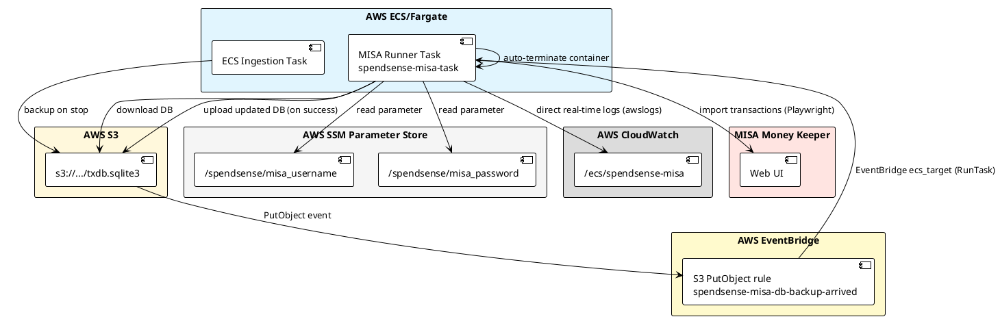

# Design: Deploy the MISA Import Runner on AWS (ECS Fargate)

> Companion to [misa_deployment_tasks.md](./misa_deployment_tasks.md).
> Builds on the automation design in [update_misa_design.md](./update_misa_design.md)
> and the cost/logging requirements in [misa_deployment_requirements.md](./misa_deployment_requirements.md).

## 1. Objective

Run the `app.misa.runner` import job automatically each day after the Gmail
ingestion pipeline and SQLite backup finish, importing pending Spend/Earn
transactions into MISA Money Keeper via Playwright on **AWS ECS Fargate**.

The MISA import must:
- Start automatically when the latest `txdb.sqlite3` is backed up to S3.
- Stream all logs directly in real-time to CloudWatch log group `/ecs/spendsense-misa`.
- Re-use the same SQLite database so `misa_import_state` dedup state survives.
- Keep MISA credentials secure in **AWS SSM Parameter Store** (`SecureString`).
- Minimize cost to near-zero ($0 fixed EBS storage, serverless per-second execution).

## 2. Scope

In scope:
- Triggering the MISA Fargate task when the daily S3 backup completes.
- Standalone ECS Fargate task definition (`spendsense-misa-task`).
- IAM execution and task roles, logging, and SSM parameter resolution.
- Native EventBridge `ecs_target` for direct `RunTask` invocation.
- Terraform for the ECS task definition, CloudWatch log group, and EventBridge rule.

Out of scope:
- Changes to the MISA automation logic itself (covered by update_misa_design.md).
- The ECS poller/correlator task architecture (covered by misa_deployment_requirements.md).

## 3. Architecture Overview



## 4. Component Design

### 4.1 Trigger: S3 event → EventBridge → ECS RunTask

The MISA runner starts as soon as `txdb.sqlite3` is uploaded to S3:

1. S3 emits an `ObjectCreated:PutObject` event for `txdb.sqlite3`.
2. EventBridge rule `spendsense-misa-db-backup-arrived` captures the event.
3. EventBridge target directly calls `ecs:RunTask` on the existing cluster (`spendsense-cluster`) with the `spendsense-misa-task` task definition.
4. No intermediary Lambda functions or EC2 start/stop scripts are required.

### 4.2 ECS Fargate Task Definition (`spendsense-misa-task`)

- **Launch Type**: `FARGATE` (Serverless, no VMs to manage).
- **Compute**: 1024 CPU units (1 vCPU), 2048 MiB RAM (sufficient for headless Chromium).
- **Network**: `awsvpc` in a public subnet with `assign_public_ip = ENABLED` (to reach MISA, ECR, S3, SSM, and CloudWatch without NAT Gateways).
- **Logging**: native `awslogs` driver sending logs directly to `/ecs/spendsense-misa`.

#### Container Command & Execution Flow

```sh
# 1. Download database from S3
python -c "
import boto3
s3 = boto3.client('s3', region_name='$REGION')
s3.download_file('$BUCKET', '$DB_KEY', '/app/data/txdb.sqlite3')
"

# 2. Run MISA batch import
START_DATE=$(date -d 'yesterday' +%Y-%m-%d)
END_DATE=$(date +%Y-%m-%d)
python -m app.misa.runner --start-date "$START_DATE" --end-date "$END_DATE"
RUN_EXIT=$?

# 3. If successful, upload updated database back to S3
if [ $RUN_EXIT -eq 0 ]; then
  python -c "
import boto3
s3 = boto3.client('s3', region_name='$REGION')
s3.upload_file('/app/data/txdb.sqlite3', '$BUCKET', '$DB_KEY')
"
fi
exit $RUN_EXIT
```

### 4.3 Credentials via SSM Parameter Store

MISA credentials are stored securely in **AWS Systems Manager Parameter Store** as `SecureString` types:
- `/spendsense/misa_username`
- `/spendsense/misa_password`

The container environment receives the parameter names:
- `MISA_USERNAME_PARAM_NAME=/spendsense/misa_username`
- `MISA_PASSWORD_PARAM_NAME=/spendsense/misa_password`

`app.misa.runner` fetches and decrypts the values on-the-fly using `boto3.client('ssm').get_parameter(Name=..., WithDecryption=True)`.

## 5. Networking and Security

### 5.1 Security Group (`spendsense-misa-task-sg`)
- **Egress**: Allow all outbound (`0.0.0.0/0`) to reach MISA Web, ECR, S3, SSM, and CloudWatch.
- **Ingress**: None (0 inbound ports open).

### 5.2 IAM Roles
- **Execution Role**: Pulls image from ECR, creates CloudWatch log streams.
- **Task Role**:
  - `s3:GetObject`, `s3:PutObject` on `s3://${var.db_backup_bucket}/${var.db_backup_key}`.
  - `ssm:GetParameter`, `ssm:GetParameters` on MISA credentials parameters.

## 6. Logging and Observability

### 6.1 Direct Real-Time CloudWatch Logs
- All `stdout` and `stderr` streams directly into `/ecs/spendsense-misa`.
- Logs can be viewed in real-time in the AWS CloudWatch Console or via AWS CLI:
  ```bash
  aws logs tail /ecs/spendsense-misa --follow
  ```

### 6.2 CloudWatch Metric Filter & Alarms
- Metric filter tracks `"[failed]"` log entries in `/ecs/spendsense-misa`.
- Triggers SNS email alerts when any import transaction fails.

## 7. Cost Estimate (ECS Fargate vs EC2)

| Resource | EC2 Runner (Previous) | ECS Fargate Task (Current) |
| :--- | :--- | :--- |
| **Compute** | ~$0.03 / month | **~$0.003 / month** (1 min/day) |
| **Storage (EBS)** | $2.88 / month (30 GB) | **$0.00 / month** (zero disk retained) |
| **SSM Parameter Store** | $0.00 / month | **$0.00 / month** |
| **CloudWatch Logs** | $0.00 / month | **$0.00 / month** |
| **Total Monthly Cost** | **~$2.91 / month** | **< $0.01 / month (Sub-cent!)** |

## 8. Security Checklist

- [x] MISA credentials stored in SSM Parameter Store (`SecureString`), never committed to git.
- [x] No inbound ports open on security group.
- [x] Least privilege IAM task policy (only access specific S3 key and SSM parameters).
- [x] Real-time audit logs in CloudWatch without credentials leaking in logs.
