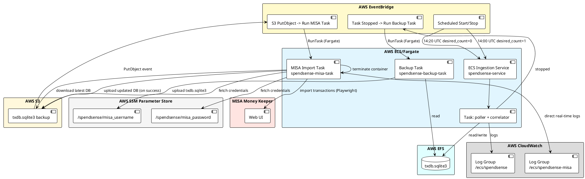
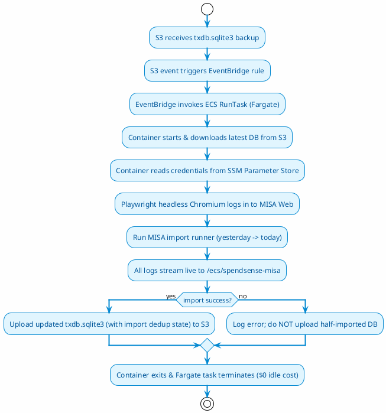

# Deployment Requirements — SpendSense AWS + MISA Import

> Scope: run the Gmail ingestion pipeline on AWS for ~15 minutes per day, then import newly parsed Spend/Earn transactions into MISA Money Keeper via an on-demand ECS Fargate Task.

---

## 1. Goals and Constraints

### 1.1 Goals

1. Run the Gmail poller + correlator on AWS automatically each day on ECS Fargate.
2. Import new Spend/Earn transactions into MISA after ingestion and backup finish.
3. Avoid duplicate MISA imports across runs using SQLite dedup state.
4. Stream all container logs directly to CloudWatch in real time for effortless debugging.
5. Minimize operational cost ($0 fixed storage, per-second serverless execution).

### 1.2 Constraints

- **Cost is the top priority**: no ALB, no NAT Gateway, no persistent EC2/EBS disks, no RDS unless proven necessary.
- **Headless browser automation**: Playwright runs headless Chromium inside the container.
- **App runs only on-demand (~15 minutes per day for ingestion, ~1 minute for MISA import)**: use scheduled scaling and event-driven Fargate task invocation.
- **Direct CloudWatch logging**: use standard `awslogs` log driver across all ECS tasks.
- **SQLite state persistence**: SQLite on EFS / S3 backup.

---

## 2. Architecture Overview

---

## 3. ECS Ingestion & Backup Tasks

### 3.1 What the ingestion task runs

1. **Poller worker** — fetches bank emails from Gmail, stores raw emails, and triggers parsing.
2. **Correlator worker** — matches debit/credit pairs into `InternalTransfer` events.

The parser runs synchronously inside the poller worker (`enqueue_for_parsing` calls `parse_email_task` directly).

### 3.2 Container command

The single Docker image switches behavior via `APP_ROLE` or direct CLI arguments:

| `APP_ROLE` | Command |
|------------|---------|
| `poller` | `python -m app.workers.poller_worker` |
| `correlator` | `python -m app.workers.correlator_worker` |
| `misa` | `python -m app.misa.runner ...` |

### 3.3 Backup on stop

When the ingestion task stops at 14:20 UTC, EventBridge triggers the one-off `spendsense-backup-task` on Fargate to upload `/app/data/txdb.sqlite3` to S3.

---

## 4. MISA Import Task (ECS Fargate)

### 4.1 Where it runs

**On AWS ECS Fargate** as an on-demand standalone task (`spendsense-misa-task`), inside the existing `spendsense-cluster`.

Advantages of ECS Fargate over EC2:
- **Direct CloudWatch Logs**: Output streams automatically to `/ecs/spendsense-misa` via `awslogs`. No need to SSH or inspect EC2 files.
- **Zero Fixed Storage Cost**: No persistent EBS volumes ($0.00 storage overhead).
- **Native EventBridge Trigger**: EventBridge uses its built-in `ecs_target` to call `ecs:RunTask` directly, removing the need for Lambda start/stop proxy scripts.
- **Cost**: Per-second billing (~$0.003 / month for a 1-minute daily run).

### 4.2 When it runs

Triggered **automatically via EventBridge** when the S3 backup arrives:

1. S3 emits an `ObjectCreated:PutObject` event for `txdb.sqlite3`.
2. EventBridge rule `spendsense-misa-db-backup-arrived` captures the event.
3. EventBridge invokes `ecs:RunTask` on `spendsense-cluster` with `spendsense-misa-task` (Fargate).

### 4.3 Fargate Task Lifecycle

### 4.4 Deduplication & State Storage

- Deduplication state is stored in the SQLite table `misa_import_state` (model: `app.misa.models.MisaImportState`).
- The MISA runner queries this table to skip already-imported rows and records newly imported transaction IDs.
- On success, the updated database is uploaded to S3 so the deduplication records persist across daily runs.

---

## 5. Docker Image Requirements

### 5.1 Single image with Playwright Chromium
- The Docker image contains Python application dependencies and Playwright with headless Chromium (`RUN playwright install --with-deps chromium`).
- Baked-in Chromium allows Fargate containers to launch and execute the import in **10–15 seconds** without runtime downloads.

---

## 6. Logging Requirements

### 6.1 Direct CloudWatch Logging
- All container `stdout` and `stderr` streams directly to CloudWatch Log Group **`/ecs/spendsense-misa`** using the `awslogs` log driver:
  - `awslogs-group: /ecs/spendsense-misa`
  - `awslogs-region: ap-southeast-1`
  - `awslogs-stream-prefix: misa`
  - `retention_in_days: 14`
- CloudWatch Metric Filter monitors `"[failed]"` log entries to trigger SNS alarm emails if any transaction fails.

---

## 7. Cost Summary

| Component | AWS Resource | Monthly Cost |
| :--- | :--- | :--- |
| **ECS Fargate Task** | 1 vCPU, 2 GB RAM (~1 min/day) | **~$0.003 / month** |
| **Permanent Storage** | None (no EBS volumes kept) | **$0.00 / month** |
| **SSM Parameter Store** | 2 Standard Parameters | **$0.00 / month** |
| **EventBridge Trigger** | Default EventBus | **$0.00 / month** |
| **CloudWatch Logs** | `/ecs/spendsense-misa` (14 days) | **$0.00 / month** |
| **Total Cost** | | **< $0.01 / month** |
