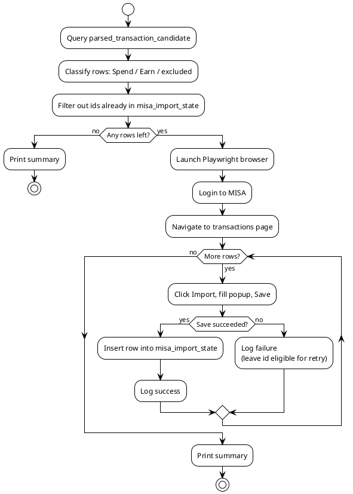

# Design: Export Spend/Earn Transactions to MISA Money Keeper

> Companion design doc to
> [update_misa_requirements.md](./update_misa_requirements.md). Section numbers
> below reference that file where relevant.

## 1. Objective
Design a standalone Python script that reads Spend/Earn candidates from
`data/txdb.sqlite3` and imports them into MISA Money Keeper's web UI
(https://moneykeeperapp.misa.vn/management/transactions) using Playwright,
with duplicate-import protection, per-row logging, and a test suite.

## 2. Scope
- Reading and classifying rows from `parsed_transaction_candidate`.
- Browser automation (login, Import button, popup form, save) via Playwright.
- **Database-backed** dedup state tracking across runs (via `misa_import_state` table).
- Logging (per-row + summary).
- Unit tests and mocked-UI browser tests.
- Out of scope: modifying the FastAPI app, the classifier/correlator pipeline,
  or MISA account/category management.

## 3. Architecture Overview

### 3.1 Components
- **DB reader** — SQLAlchemy session against the existing `Base`/`SessionLocal`
  (`app/db/session.py`), reusing the existing `ParsedTransactionCandidate` model.
  Adds a new `MisaImportState` table for import tracking.
- **Classifier/mapper** — pure Python, no I/O; turns a candidate row into a
  `MisaTransaction` (amount, account, datetime, category) or `None` if excluded.
- **Dedup store** — SQLAlchemy-backed table `misa_import_state` mapping
  `parsed_candidate_id` → import result metadata (status, timestamp).
- **MISA client** — Playwright wrapper encapsulating login, session reuse,
  navigation, and the "click Import → fill popup → Save" flow.
- **Runner (CLI entrypoint)** — orchestrates: query DB → classify/map → filter
  already-imported (using `misa_import_state`) → for each row, call MISA client →
  update `misa_import_state` on success → log → print summary.

### 3.1.1 Playwright runtime installation
Playwright and its Chromium browser are **not** installed inside the Docker image.
They are installed at runtime on the dedicated EC2 instance that runs the MISA
import (see deployment_requirements.md §5.2). This keeps the ECR image small,
speeds up ECS task startup, and avoids EBS persistence cost. For local
development and tests, install Playwright manually:
`pip install playwright && playwright install chromium`.

### 3.2 Proposed file layout
```
app/
  db/
    models/
      misa_import_state.py  # MisaImportState SQLAlchemy model
  misa/
    __init__.py
    models.py          # MisaTransaction dataclass, MisaImportResult
    query.py           # DB query + classification (Spend/Earn) per §2.1 requirements
    mapper.py          # candidate -> MisaTransaction field mapping per §2.2
    dedup_store.py      # DB-backed dedup store using MisaImportState
    selectors.py        # all MISA CSS/text selectors, isolated for easy update
    client.py           # Playwright: login(), open_transactions(), add_transaction()
    runner.py           # CLI entrypoint / orchestration
tests/
  test_misa_query.py     # unit tests for query.py / mapper.py
  test_misa_dedup.py     # unit tests for dedup_store.py (DB-backed)
  test_misa_client.py    # Playwright tests against local HTML fixtures
  fixtures/
    misa_login.html
    misa_transactions.html
```
This mirrors the existing `app/<module>/` + `tests/test_<module>.py` convention
already used for `classification`, `correlation`, `parsing`, etc.

### 3.3 High-Level Flow


## 4. Data Layer Design

### 4.1 Query and classification (`query.py`)
- Query all `ParsedTransactionCandidate` rows (optionally filtered by
  `--start-date`/`--end-date` on `datetime_sgt`, per requirements §6).
- Classify per requirements §2.1, using only `inferred_sender` /
  `inferred_receiver` (string equality against the literal `"Other"`):
  ```python
  def classify(row) -> Literal["Spend", "Earn", None]:
      is_sender_other = row.inferred_sender == "Other"
      is_receiver_other = row.inferred_receiver == "Other"
      if not is_sender_other and is_receiver_other:
          return "Spend"
      if is_sender_other and not is_receiver_other:
          return "Earn"
      return None  # both Other (unparsed) or neither Other (internal transfer)
  ```
- Rows with `classify() is None` are skipped silently (not logged as failures —
  they were never candidates for import).

### 4.2 Field mapping (`mapper.py`)
| MisaTransaction field | Spend source | Earn source |
|---|---|---|
| `amount` | `amount` | `amount` |
| `account` | `inferred_sender` | `inferred_receiver` |
| `datetime` | `datetime_sgt` (formatted `DD/MM/YYYY HH:MM`, confirmed — requirements §10.2) | same |
| `category` | fixed constant `CATEGORY = "Bars & Coffee"` | fixed constant `EARN_CATEGORY = "Balance"` (confirmed 2026-08-07: Spend and Earn have distinct category lists in MISA, so a single shared category is invalid for one of the two types) |

### 4.3 Dedup store (`dedup_store.py`)
- Backed by the `misa_import_state` SQLAlchemy table in the same SQLite database
  that holds the parsed candidates.
- Schema (see `app/db/models/misa_import_state.py`):
  ```python
  class MisaImportState(Base):
      __tablename__ = "misa_import_state"

      parsed_candidate_id = Column(
          Uuid(as_uuid=True),
          ForeignKey("parsed_transaction_candidate.id"),
          primary_key=True,
      )
      imported_at = Column(TIMESTAMP(timezone=True), nullable=False)
      amount = Column(Numeric(18, 2), nullable=True)
      account = Column(String, nullable=True)
      datetime = Column(String, nullable=True)
      classification = Column(String, nullable=True)
      status = Column(String, nullable=False, default="imported")
  ```
- Only entries with `status == "imported"` are treated as "already done" and
  filtered out of future runs. Failed attempts are not written, so they're
  retried automatically next run (requirements §4).
- Because the state lives in the same SQLite file as the candidates, it is
  automatically backed up to and restored from S3 alongside the DB. No separate
  file sync is needed.

## 5. MISA Automation Layer

### 5.1 `selectors.py`
All selectors kept as named constants. **Confirmed working (2026-08-07)** via
manual scripts, following a `_SPEND_`/`_EARN_` naming convention for any
field whose DOM location differs between the two popup tabs:
`LOGIN_USERNAME_INPUT`, `LOGIN_PASSWORD_INPUT`, `LOGIN_SUBMIT_BUTTON`,
`LOGIN_SUCCESS_INDICATOR`, `LOGIN_ERROR_INDICATOR`, `IMPORT_BUTTON`,
`SINGLE_TRANSACTION_OPTION`, `IMPORT_BUTTON_RESULT`, `POPUP_SPEND_TAB`,
`POPUP_EARN_TAB`, `POPUP_AMOUNT_SPEND_INPUT`, `POPUP_AMOUNT_EARN_INPUT`,
`POPUP_ACCOUNT_SPEND_INPUT`/`POPUP_ACCOUNT_SPEND_OPTIONS_CONTAINER`,
`POPUP_ACCOUNT_EARN_INPUT`/`POPUP_ACCOUNT_EARN_OPTIONS_CONTAINER`,
`POPUP_DATE_SPEND_INPUT`, `POPUP_DATE_EARN_INPUT`,
`POPUP_CATEGORY_SPEND_INPUT`, `POPUP_CATEGORY_EARN_INPUT`,
`POPUP_SAVE_AND_ADD_BUTTON` ("Lưu và thêm" / Save & Add Another), and
`POPUP_SAVE_AND_CLOSE_BUTTON` ("Lưu" / Save & Close, exact-text match
scoped to the footer to avoid matching "Lưu và thêm" — confirmed
2026-08-08 via `scripts/misa_fill_popup_spend_check.py`, popup closes and
the new row appears in the list). Still placeholder/unconfirmed:
`LOGIN_2FA_INDICATOR` (2FA never actually triggered) and
`SUCCESS_INDICATOR`/`ERROR_INDICATOR` (guessed text/class, never matched
in practice even on confirmed-successful saves — the real success signal
appears to be the popup closing / list count incrementing, not a toast).
No other module should contain a hardcoded selector string.

### 5.2 `client.py`
- `login(page, username, password) -> bool`
  - Navigates to MISA login URL, fills credentials, submits.
  - If a 2FA/captcha element is detected and cannot be handled automatically,
    switches to interactive mode: opens headed browser and waits (with a
    timeout) for the user to complete login manually.
  - On success, persists `context.storage_state(path=...)` for reuse next run.
  - **Implemented and confirmed working.**
- `click_import_button(page) -> bool`
  - Clicks Import → Single Transaction option → waits for the popup.
  - Includes a `page.wait_for_timeout(POPUP_ACCOUNT_SETTLE_MS)` (2.5s) after
    the popup opens, to let MISA's async default-account load settle before
    any caller touches the account field (see §9 Failure Handling). **Only
    covers the initial popup-open case** — switching tabs (Spend↔Earn)
    re-triggers the same async load and needs an equivalent wait after the
    tab click too; not yet added to `client.py` (currently only present in
    the ad-hoc Earn manual test script).
- `select_account(page, account_name) -> bool`
  - Clicks the account dropdown, waits for the options container, clicks the
    matching option. **Currently hardcoded to the Spend selectors** — needs
    a `container`/tab-aware parameter (or a `classification` argument) to
    support Earn, mirroring `selectors.account_option_selector()`'s existing
    `container` parameter.
- `add_transaction(page, tx: MisaTransaction) -> MisaImportResult`
  - Clicks Import button, waits for popup, fills Amount/Account/Date/Category,
    clicks Save.
  - **Known gaps (2026-08-07)**: (1) always uses the Spend-tab selectors
    regardless of `tx`'s classification — no tab click, no Spend/Earn
    selector switch; (2) fills the category field via `fill()` only, but
    this does not commit the selection — confirmed the matching dropdown
    option must also be explicitly clicked afterward, or Save is blocked by
    validation; (3) uses `POPUP_SAVE_AND_ADD_BUTTON`, which leaves the popup
    open in "add another" mode instead of closing it — not suitable for a
    real per-row import loop until the real "Lưu" button is identified.
  - Waits for either a success indicator or an error indicator (both defined
    in `selectors.py`); returns a result object with `success: bool` and
    `error_message: Optional[str]`. **Unconfirmed**: neither indicator has
    ever matched in practice — the more reliable signal observed so far is
    the background transaction list's total-row counter incrementing, or
    the popup actually closing (only true for the real "Lưu" button, not
    `POPUP_SAVE_AND_ADD_BUTTON`).
  - Wrapped in try/except so a single row's exception is caught, converted to
    a failed `MisaImportResult`, and does not propagate (requirements §7
    Resilience).

### 5.3 Session reuse
- On subsequent runs, `client.py` first tries to create a Playwright context
  from the saved `storage_state` file and checks if it's still authenticated
  (e.g. navigating to the transactions page redirects to login or not). Falls
  back to full login if the session expired.

## 6. Logging Design
- Use Python's standard `logging` module, configured similarly to
  `app/core/logging.py` if reusable, otherwise a small local
  `logging.basicConfig` in `runner.py` (since this runs standalone, not as
  part of the FastAPI app).
- Per-row log line (on success):
  `INFO  [imported] id=<id> amount=<amount> account=<account> datetime=<dt>`
- Per-row log line (on failure):
  `ERROR [failed]   id=<id> amount=<amount> account=<account> datetime=<dt> reason=<msg>`
- End-of-run summary:
  `INFO  Summary: considered=<n> imported=<n> failed=<n> skipped(already imported)=<n>`

## 7. CLI Design (`runner.py`)
```
python -m app.misa.runner \
  [--start-date YYYY-MM-DD] [--end-date YYYY-MM-DD] \
  [--headed] [--dry-run] [--limit N]
```
- `--dry-run`: classify + map rows and print what *would* be imported, without
  launching a browser or touching the dedup store. Useful for validating §2/§4
  logic before wiring up real MISA selectors.
- `--headed`: force a visible (non-headless) browser, e.g. for first-time
  login or debugging selector issues.
- `--limit`: cap the number of rows to import (useful for small verification batches).

`--state-file` is removed because dedup state is now stored in the database.

### 7.1 Environment variables
- `MISA_USERNAME`, `MISA_PASSWORD` — loaded via `python-dotenv` from `.env.misa`
  (never committed; confirm `.env.misa` is in `.gitignore`).

### 7.2 Dependencies
- `playwright` is **not** in `requirements.txt`. It is installed at runtime on
  the EC2 MISA import instance, or manually for local development/tests.
- One-time setup step documented in README/Makefile for local dev:
  `pip install playwright && playwright install chromium`.

### 7.3 Date/time formatting
- **Confirmed (2026-08-07)**: MISA's date field expects `DD/MM/YYYY HH:MM`
  (not ISO 8601). Implemented in `mapper.py`'s `format_datetime()` via
  `dt.strftime("%d/%m/%Y %H:%M")`.

## 8. Security Design
- Credentials only via environment variables/`.env.misa`; never logged, never
  written to the dedup state table or committed to git.
- `storage_state` session file (contains cookies) treated as sensitive: stored
  outside version control (add to `.gitignore`), same handling as `.env.misa`.
- No transaction data is sent anywhere except the user's own MISA account via
  their own authenticated session (no third-party network calls).

## 9. Failure Handling
- DB connection errors: fail fast with a clear error before opening a browser.
- Login failure (bad credentials / persistent 2FA block): log a clear error
  and exit non-zero without attempting any imports.
- Per-row failure (validation error, timeout, selector not found): caught,
  logged, counted in summary, run continues to next row (requirements §7).
- Unexpected browser crash: dedup store only reflects rows actually confirmed
  saved before the crash, so re-running is safe.

## 10. Testing Design
(See requirements §9 for full detail.)
- `tests/test_misa_query.py` / mapper: pure unit tests using in-memory
  candidate objects/rows — no DB or browser needed for the classification
  truth table (Spend/Earn/excluded cases from confirmed real-data patterns).
- `tests/test_misa_dedup.py`: unit tests using the shared test database
  (`tests/conftest.py` creates/drops tables per session).
- `tests/test_misa_client.py`: Playwright tests driven against local static
  HTML fixtures under `tests/fixtures/` simulating MISA's login page and
  Import popup, so they run offline/without real credentials.
- Manual test pass against a MISA sandbox/non-production account before first
  real run against production data.

## 11. Acceptance Criteria
Same as requirements §8:
1. Running the script imports all not-yet-imported Spend/Earn rows.
2. Imported transactions in MISA show correct amount, account, date, and the
   correct category for the row's classification (`"Bars & Coffee"` for
   Spend, `"Balance"` for Earn).
3. Re-running does not re-import previously successful rows.
4. Console/log output shows per-row success/failure and an end-of-run summary.
5. No MISA credentials are stored in the repository.

## 12. Open Items (blocking full implementation)
1. ~~Real selectors/HTML for MISA login, Import button, and popup form
   (§5.1).~~ **Mostly resolved (2026-08-07)** — see §5.1 for the confirmed
   list. Remaining: the real "Lưu" (Save & Close) button selector.
2. ~~Confirmed date/time format expected by the MISA date field (§7.3).~~
   **Resolved**: `DD/MM/YYYY HH:MM`.
3. Confirmed presence/absence of 2FA/captcha on MISA login (§5.2). **Still
   open** — never actually triggered during testing.
4. **(New, 2026-08-07, blocking for §5.2/`client.py`)** `add_transaction()`
   must be extended to: (a) click the Spend or Earn tab per `tx`'s
   classification and select the matching selector set; (b) re-apply the
   `POPUP_ACCOUNT_SETTLE_MS` wait after any tab switch, not just after the
   initial popup open; (c) explicitly click the matching category dropdown
   option after `fill()`, not rely on `fill()` alone; (d) use the real
   Save-and-close button once found, instead of
   `POPUP_SAVE_AND_ADD_BUTTON` (Save & Add Another), which would otherwise
   leave the popup open after every row in a real import loop.
5. **(New, 2026-08-07)** No MISA sandbox/test account is available — all
   manual verification so far has been against the real/production MISA
   account. One real test Earn transaction (amount 10, account "Helper",
   category "Balance") was created as a side effect of confirming the Save
   button behavior and has not yet been cleaned up.
