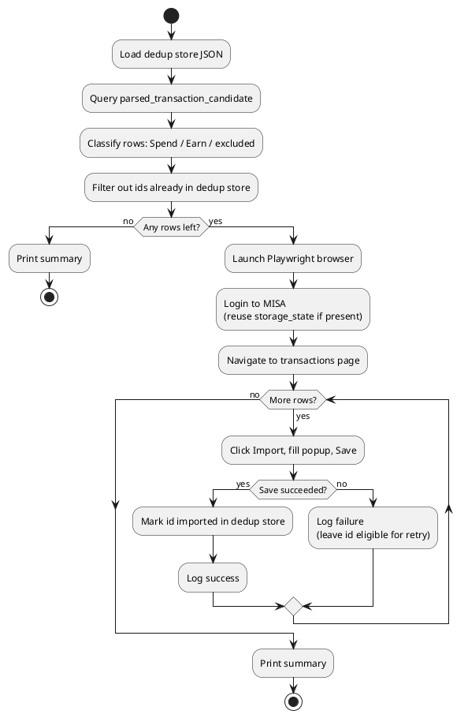

# Design: Export Spend/Earn Transactions to MISA Money Keeper

> Companion design doc to
> [update_misa_requirements.md](./update_misa_requirements.md). Section numbers
> below reference that file where relevant.

## 1. Objective
Design a standalone Python script that reads Spend/Earn candidates from
`data/txdb.sqlite3` and imports them into MISA Money Keeper's web UI
(https://moneykeeperapp.misa.vn/management/transactions) using Playwright,
with duplicate-import protection, per-row logging, and a test suite.

## 2. Scope
- Reading and classifying rows from `parsed_transaction_candidate`.
- Browser automation (login, Import button, popup form, save) via Playwright.
- Local dedup state tracking across runs.
- Logging (per-row + summary).
- Unit tests and mocked-UI browser tests.
- Out of scope: modifying the FastAPI app, the classifier/correlator pipeline,
  or MISA account/category management.

## 3. Architecture Overview

### 3.1 Components
- **DB reader** — SQLAlchemy session against the existing `Base`/`SessionLocal`
  (`app/db/session.py`), reusing the existing `ParsedTransactionCandidate` model.
  No schema changes required.
- **Classifier/mapper** — pure Python, no I/O; turns a candidate row into a
  `MisaTransaction` (amount, account, datetime, category) or `None` if excluded.
- **Dedup store** — local JSON file mapping candidate `id` → import result
  metadata (status, timestamp).
- **MISA client** — Playwright wrapper encapsulating login, session reuse,
  navigation, and the "click Import → fill popup → Save" flow.
- **Runner (CLI entrypoint)** — orchestrates: load dedup store → query DB →
  classify/map → filter already-imported → for each row, call MISA client →
  update dedup store → log → print summary.

### 3.2 Proposed file layout
```
app/
  misa/
    __init__.py
    models.py          # MisaTransaction dataclass, MisaImportResult
    query.py           # DB query + classification (Spend/Earn) per §2.1 requirements
    mapper.py          # candidate -> MisaTransaction field mapping per §2.2
    dedup_store.py      # local JSON state file read/write
    selectors.py        # all MISA CSS/text selectors, isolated for easy update
    client.py           # Playwright: login(), open_transactions(), add_transaction()
    runner.py           # CLI entrypoint / orchestration
tests/
  test_misa_query.py     # unit tests for query.py / mapper.py
  test_misa_dedup.py     # unit tests for dedup_store.py
  test_misa_client.py    # Playwright tests against local HTML fixtures
  fixtures/
    misa_login.html
    misa_transactions.html
```
This mirrors the existing `app/<module>/` + `tests/test_<module>.py` convention
already used for `classification`, `correlation`, `parsing`, etc.

### 3.3 High-Level Flow


## 4. Data Layer Design

### 4.1 Query and classification (`query.py`)
- Query all `ParsedTransactionCandidate` rows (optionally filtered by
  `--start-date`/`--end-date` on `datetime_sgt`, per requirements §6).
- Classify per requirements §2.1, using only `inferred_sender` /
  `inferred_receiver` (string equality against the literal `"Other"`):
  ```python
  def classify(row) -> Literal["Spend", "Earn", None]:
      is_sender_other = row.inferred_sender == "Other"
      is_receiver_other = row.inferred_receiver == "Other"
      if not is_sender_other and is_receiver_other:
          return "Spend"
      if is_sender_other and not is_receiver_other:
          return "Earn"
      return None  # both Other (unparsed) or neither Other (internal transfer)
  ```
- Rows with `classify() is None` are skipped silently (not logged as failures —
  they were never candidates for import).

### 4.2 Field mapping (`mapper.py`)
| MisaTransaction field | Spend source | Earn source |
|---|---|---|
| `amount` | `amount` | `amount` |
| `account` | `inferred_sender` | `inferred_receiver` |
| `datetime` | `datetime_sgt` (formatted, see §7.3 below / requirements §10.2) | same |
| `category` | fixed constant `"Bar & Coffee"` | fixed constant `"Bar & Coffee"` |

### 4.3 Dedup store (`dedup_store.py`)
- JSON file, default path `ai/update_misa_implementation/imported_state.json`
  (configurable via `--state-file` / env var).
- Schema:
  ```json
  {
    "<candidate_id>": {
      "status": "imported",
      "imported_at": "2026-08-05T12:00:00+08:00",
      "amount": "10.50",
      "account": "PayLah"
    }
  }
  ```
- Only entries with `status == "imported"` are treated as "already done" and
  filtered out of future runs. Failed attempts are not written, so they're
  retried automatically next run (requirements §4).
- Written atomically (write to temp file + rename) to avoid corruption on
  crash mid-run (requirements §7 Reliability).

## 5. MISA Automation Layer

### 5.1 `selectors.py`
All selectors kept as named constants (e.g. `LOGIN_USERNAME_INPUT`,
`IMPORT_BUTTON`, `POPUP_AMOUNT_INPUT`, `POPUP_SAVE_BUTTON`, `SUCCESS_TOAST`,
`ERROR_MESSAGE`). Currently placeholders — must be filled in once the real
MISA DOM is inspected (requirements §3.3 / §10.1). No other module should
contain a hardcoded selector string.

### 5.2 `client.py`
- `login(page, username, password) -> bool`
  - Navigates to MISA login URL, fills credentials, submits.
  - If a 2FA/captcha element is detected and cannot be handled automatically,
    switches to interactive mode: opens headed browser and waits (with a
    timeout) for the user to complete login manually.
  - On success, persists `context.storage_state(path=...)` for reuse next run.
- `add_transaction(page, tx: MisaTransaction) -> MisaImportResult`
  - Clicks Import button, waits for popup, fills Amount/Account/Date/Category,
    clicks Save.
  - Waits for either a success indicator or an error indicator (both defined
    in `selectors.py`); returns a result object with `success: bool` and
    `error_message: Optional[str]`.
  - Wrapped in try/except so a single row's exception is caught, converted to
    a failed `MisaImportResult`, and does not propagate (requirements §7
    Resilience).

### 5.3 Session reuse
- On subsequent runs, `client.py` first tries to create a Playwright context
  from the saved `storage_state` file and checks if it's still authenticated
  (e.g. navigating to the transactions page redirects to login or not). Falls
  back to full login if the session expired.

## 6. Logging Design
- Use Python's standard `logging` module, configured similarly to
  `app/core/logging.py` if reusable, otherwise a small local
  `logging.basicConfig` in `runner.py` (since this runs standalone, not as
  part of the FastAPI app).
- Per-row log line (on success):
  `INFO  [imported] id=<id> amount=<amount> account=<account> datetime=<dt>`
- Per-row log line (on failure):
  `ERROR [failed]   id=<id> amount=<amount> account=<account> datetime=<dt> reason=<msg>`
- End-of-run summary:
  `INFO  Summary: considered=<n> imported=<n> failed=<n> skipped(already imported)=<n>`

## 7. CLI Design (`runner.py`)
```
python -m app.misa.runner \
  [--start-date YYYY-MM-DD] [--end-date YYYY-MM-DD] \
  [--state-file PATH] [--headed] [--dry-run]
```
- `--dry-run`: classify + map rows and print what *would* be imported, without
  launching a browser or touching the dedup store. Useful for validating §2/§4
  logic before wiring up real MISA selectors.
- `--headed`: force a visible (non-headless) browser, e.g. for first-time
  login or debugging selector issues.

### 7.1 Environment variables
- `MISA_USERNAME`, `MISA_PASSWORD` — loaded via `python-dotenv` from `.env`
  (never committed; confirm `.env` is in `.gitignore`).

### 7.2 Dependencies to add
- `playwright` in `requirements.txt`.
- One-time setup step documented in README/Makefile: `playwright install chromium`.

### 7.3 Date/time formatting
- Placeholder using ISO date (`YYYY-MM-DD`) until the real MISA form format is
  confirmed (requirements §10.2); isolated in `mapper.py` so it's a one-line
  change once known.

## 8. Security Design
- Credentials only via environment variables/`.env`; never logged, never
  written to the dedup state file or committed to git.
- `storage_state` session file (contains cookies) treated as sensitive: stored
  outside version control (add to `.gitignore`), same handling as `.env`.
- No transaction data is sent anywhere except the user's own MISA account via
  their own authenticated session (no third-party network calls).

## 9. Failure Handling
- DB connection errors: fail fast with a clear error before opening a browser.
- Login failure (bad credentials / persistent 2FA block): log a clear error
  and exit non-zero without attempting any imports.
- Per-row failure (validation error, timeout, selector not found): caught,
  logged, counted in summary, run continues to next row (requirements §7).
- Unexpected browser crash: dedup store only reflects rows actually confirmed
  saved before the crash, so re-running is safe.

## 10. Testing Design
(See requirements §9 for full detail.)
- `tests/test_misa_query.py` / mapper: pure unit tests using in-memory
  candidate objects/rows — no DB or browser needed for the classification
  truth table (Spend/Earn/excluded cases from confirmed real-data patterns).
- `tests/test_misa_dedup.py`: unit tests using a temp JSON file.
- `tests/test_misa_client.py`: Playwright tests driven against local static
  HTML fixtures under `tests/fixtures/` simulating MISA's login page and
  Import popup, so they run offline/without real credentials.
- Manual test pass against a MISA sandbox/non-production account before first
  real run against production data.

## 11. Acceptance Criteria
Same as requirements §8:
1. Running the script imports all not-yet-imported Spend/Earn rows.
2. Imported transactions in MISA show correct amount, account, date, and the
   fixed `"Bar & Coffee"` category.
3. Re-running does not re-import previously successful rows.
4. Console/log output shows per-row success/failure and an end-of-run summary.
5. No MISA credentials are stored in the repository.

## 12. Open Items (blocking full implementation)
1. Real selectors/HTML for MISA login, Import button, and popup form
   (§5.1) — needed to implement `selectors.py` and `client.py` for real.
2. Confirmed date/time format expected by the MISA date field (§7.3).
3. Confirmed presence/absence of 2FA/captcha on MISA login (§5.2).
