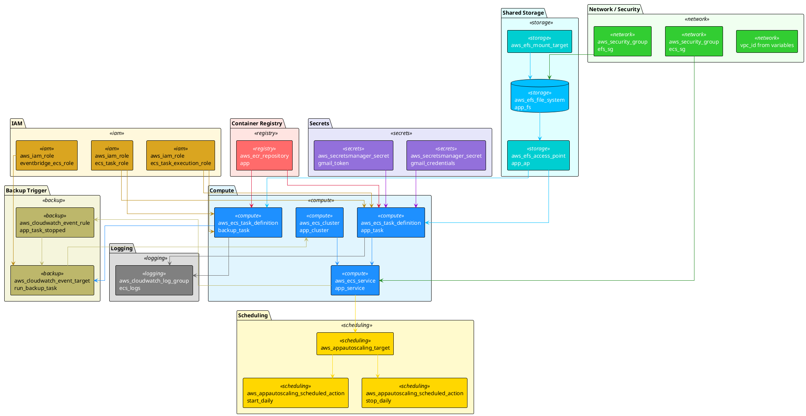
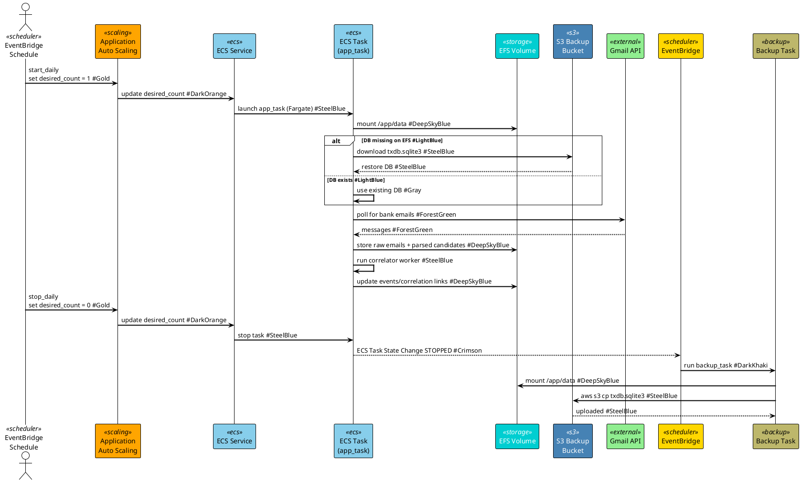
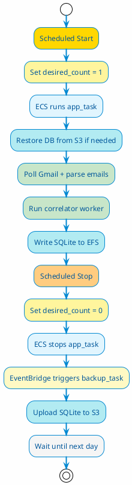

# Deploy_1 Terraform Architecture

> File: [deploy_1/main.tf](deploy_1/main.tf)  
> Region: `ap-southeast-1` (configurable via `var.aws_region`)  
> Goal: Run the SpendSense Gmail poller + correlator on AWS Fargate for ~15 minutes per day, with SQLite persisted on EFS and backed up to S3.

---

## 1. Resource Overview

---

## 2. Data Flow During a Daily Run

---

## 3. Resource Details

### 3.1 Container Registry

| Resource | Purpose |
|----------|---------|
| `aws_ecr_repository.app` | Stores the `spend_sense` Docker image. Scan on push enabled. |

### 3.2 Secrets

| Resource | Purpose |
|----------|---------|
| `aws_secretsmanager_secret.gmail_credentials` | Holds `credentials.json` for Gmail OAuth. |
| `aws_secretsmanager_secret.gmail_token` | Holds `token.json` for Gmail OAuth. |

These are injected into the ECS task container as environment variables `GMAIL_CREDENTIALS_JSON` and `GMAIL_TOKEN_JSON`.

### 3.3 Shared Storage

| Resource | Purpose |
|----------|---------|
| `aws_efs_file_system.app_fs` | Managed NFS for persisting SQLite across task runs. |
| `aws_efs_mount_target.mt` | Mounts EFS into the subnets used by ECS tasks. |
| `aws_efs_access_point.app_ap` | Access point at `/spendsense` with POSIX user UID/GID 1000. |

The SQLite file lives on EFS and is mounted into the container at `/app/data`.

### 3.4 IAM Roles

| Resource | Purpose |
|----------|---------|
| `aws_iam_role.ecs_task_execution_role` | Allows Fargate to pull images, write logs, and read Secrets Manager. |
| `aws_iam_role.ecs_task_role` | Allows the running container to access S3 backup bucket. |
| `aws_iam_role.eventbridge_ecs_role` | Allows EventBridge to run the backup ECS task. |

### 3.5 Network / Security

| Resource | Purpose |
|----------|---------|
| `aws_security_group.ecs_sg` | Allows all outbound traffic from ECS tasks. |
| `aws_security_group.efs_sg` | Allows inbound NFS (port 2049) only from `ecs_sg`. |

### 3.6 ECS Compute

| Resource | Purpose |
|----------|---------|
| `aws_ecs_cluster.app_cluster` | Logical cluster for all Fargate tasks. |
| `aws_ecs_task_definition.app_task` | Main task: runs the poller worker. Mounts EFS, restores DB from S3 if missing. |
| `aws_ecs_task_definition.backup_task` | One-off task: uploads `txdb.sqlite3` from EFS to S3. |
| `aws_ecs_service.app_service` | ECS service running `app_task`. Desired count is controlled by scheduled scaling. |

### 3.7 Scheduling

| Resource | Purpose |
|----------|---------|
| `aws_appautoscaling_target.ecs_service_target` | Tracks the ECS service as a scalable target. Min=0, Max=1. |
| `aws_appautoscaling_scheduled_action.start_daily` | Sets desired count to 1 at scheduled time. |
| `aws_appautoscaling_scheduled_action.stop_daily` | Sets desired count to 0 at scheduled time. |

### 3.8 Backup Trigger

| Resource | Purpose |
|----------|---------|
| `aws_cloudwatch_event_rule.app_task_stopped` | Listens for ECS task STOPPED events for this service. |
| `aws_cloudwatch_event_target.run_backup_task` | Triggers the backup task when the main task stops. |

### 3.9 Logging

| Resource | Purpose |
|----------|---------|
| `aws_cloudwatch_log_group.ecs_logs` | Collects logs from all containers. 14-day retention. |

---

## 4. Daily Lifecycle

---

## 5. Known Gaps

1. **Task command is wrong**: `app_task` runs `python -m app.workers.poller_worker --host 0.0.0.0 --port 8000`. The poller worker does not accept host/port arguments.
2. **Only one container role**: the task definition runs the poller only. If you also want the correlator to run, it must be added as another container or run in the same process.
3. **No API**: there is no FastAPI container in this deployment.
4. **No container health check**: ECS only knows if the process exited.
5. **Public IP**: tasks get public IPs because they need outbound internet for ECR, Secrets Manager, Gmail, and S3.

For a 15-minute daily run, these gaps are acceptable except for #1, which prevents the task from starting correctly.
