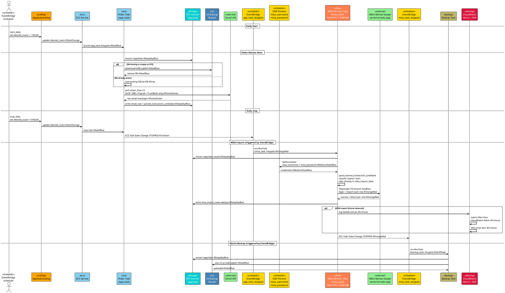

# Architecture — SpendSense

## System Overview

SpendSense is a **Python automation pipeline** that:
1. Polls Gmail for bank transaction emails (ACB, DBS, PayLah, TrustBank)
2. Parses each email body using **bank-specific regex patterns** to extract structured transaction data
3. Classifies each transaction as `Spend`, `Earn`, or `InternalTransfer` using a **deterministic rule table**
4. Optionally correlates debit/credit email pairs into a single `InternalTransfer` event (greedy scoring)
5. Imports `Spend`/`Earn` rows into **MISA Money Keeper** via Playwright browser automation

All components run inside a **single Docker image** switched by the `APP_ROLE` environment variable.

---

## End-to-End Data Flow

```
Gmail Inbox (bank alert emails)
    │
    │  Gmail API  messages.list("newer_than:1d")
    │  Filter: from_bank_email()
    │           mailalert@acb.com.vn
    │           ibanking.alert@dbs.com
    │           paylah.alert@dbs.com
    │           from_us@trustbank.sg
    ▼
┌──────────────────────────────────────────────────────────────────┐
│  poller_worker  (loop, every POLL_INTERVAL_SECONDS=300s)          │
│                                                                    │
│  GmailPoller.poll_once()                                           │
│    ├─ idempotency check: email_raw.gmail_message_id (UNIQUE)       │
│    ├─ GmailClient.decode_email() → subject + body (HTML)          │
│    └─ INSERT INTO email_raw                                        │
│         ↓ immediately calls                                         │
│  parser_worker.enqueue_for_parsing(email_raw.id)                  │
└───────────────────────┬──────────────────────────────────────────┘
                        │ (synchronous call, no queue)
                        ▼
┌──────────────────────────────────────────────────────────────────┐
│  parser_worker.parse_email_task()                                  │
│                                                                    │
│  1. extract_plain_text(html_body)  → BeautifulSoup strip tags     │
│  2. parse_email(subject, plain_text):                              │
│       a. extract_amount()                                          │
│            ├─ SGD: AMOUNT_REGEX_SGD  → "SGD 123.45"               │
│            └─ VND: AMOUNT_REGEX_VND  → "123,456 VND" (last match) │
│       b. extract_parties(body):                                    │
│            ├─ DBS/PayLah: FROM_LINE + TO_LINE regex                │
│            ├─ TrustBank:  TRUST_SPENT + TRUST_RECEIVED regex       │
│            └─ ACB:        keyword match ("debit"/"credit"+"6422417")│
│       c. map_account_alias()  → canonical name                     │
│            "ending 7013" → DBS                                     │
│            "ending 3162" → PayLah                                  │
│            "Trust App"   → Trust                                   │
│            "WESTERN UNION" → ACB Online                            │
│       d. detect_debit_credit()  → "debit"/"credit"                │
│       e. dectect_type()  → "spend"/"earn"/"InternalTransfer"       │
│       f. extract_date(sender, receiver, text)                      │
│            ├─ DBS→PayLah: DATE_PATTERNS_DBS_2_PAYLAH               │
│            └─ all others: DATE_PATTERNS (4 regex patterns)         │
│  3. INSERT INTO parsed_transaction_candidate                        │
└───────────────────────┬──────────────────────────────────────────┘
                        │
           ┌────────────┴────────────┐
           │ (optional)              │ (primary)
           ▼                         ▼
┌───────────────────────┐  ┌────────────────────────────────────────┐
│ correlator_worker     │  │ misa.runner  (on-demand batch job)      │
│ (loop, every 60s)     │  │                                          │
│                       │  │  misa.query.get_classified_candidates() │
│ correlate_once():     │  │    Spend:  sender != Other, rcvr = Other│
│  PendingStore.get_    │  │    Earn:   sender = Other, rcvr != Other│
│   pending(debit)      │  │    Skip:   InternalTransfer / unparsed  │
│  PendingStore.get_    │  │                                          │
│   pending(credit)     │  │  misa.dedup_store.DedupStore:           │
│                       │  │    skip if misa_import_state row exists  │
│  Scoring per pair:    │  │                                          │
│   amount must match   │  │  Playwright → Chromium → MISA Web:      │
│   |Δt| ≤ 15 min       │  │    login() with storage_state cache     │
│   score = (15-Δt)/10  │  │    for each row:                         │
│                       │  │      client.add_transaction()            │
│  Greedy best-match:   │  │      INSERT INTO misa_import_state       │
│   sort score desc     │  │                                          │
│   skip used pairs     │  │  End-of-run summary (rows ok/fail)       │
│                       │  └────────────────────────────────────────┘
│  → INSERT Event        │
│  → INSERT              │
│    CorrelationLink     │
└───────────────────────┘
```

---

## Parsing Detail: How Each Bank is Handled

### DBS / PayLah
- **Sender/Receiver:** Extracted via `FROM_LINE = re.compile(r"From:\s*(.*?)\s*To:", re.DOTALL)` and `TO_LINE`
- **Date:** Special `DATE_PATTERNS_DBS_2_PAYLAH` applied when sender=DBS and receiver=PayLah; general `DATE_PATTERNS` otherwise
- **Amount:** `AMOUNT_REGEX_SGD` — matches `SGD 123.45` or `SGD$123.45`
- **Transfer detection:** `"(NRIC ending 014U)"`, `"WESTERN UNION"`, `"You've successfully top-up to your PayLah!"` → overrides type to `InternalTransfer`

### TrustBank
- **Sender:** `TRUST_SPENT = re.compile(r"You've spent\s*(.*)")` — captures spender
- **Receiver:** `TRUST_RECEIVED = re.compile(r"You've received\s*(.*)")` — captures receiver
- **Fallback receiver:** If text contains `"(ending 014)"` → infer `Trust`
- **Fallback sender:** If `"You've received a PayNow transfer"` → sender = `DBS`
- **InternalTransfer:** When receiver=Trust and `"You've received a PayNow transfer"` present

### ACB (Vietnam)
- **Direction:** `"debit"` in body → spend; `"credit"` in body → earn
- **Account number:** `"6422417"` in body → `ACB Online` (your account); else plain `ACB`
- **InternalTransfer signals:** `"FINFAN"` in text → DBS→ACB Online transfer; `"Debit -"` in ACB Online → InternalTransfer

---

## Classification Rule Table

Source: [`app/classification/rule_table.py`](../app/classification/rule_table.py)

The classifier first does a deterministic `(sender, receiver)` lookup:

| Sender | Receiver | Event Type | Emails needed |
|--------|----------|-----------|---------------|
| `DBS` | `Trust` | InternalTransfer | 2 |
| `DBS` | `ACB Online` | InternalTransfer | 2 |
| `ACB Online` | `ACB` | InternalTransfer | 2 |
| `DBS` | `Paylah` | InternalTransfer | 1 |
| `ACB Online` | `Other` | Spend | 1 |
| `ACB` | `Other` | Spend | 1 |
| `Trust` | `Other` | Spend | 1 |
| `Paylah` | `Other` | Spend | 1 |
| `Other` | `DBS` | Earn | 1 |

**Fallback logic** (when no rule matches):
1. `debit_credit ∈ {debit, spend}` and `type_info == "spend"` → **Spend**
2. `debit_credit ∈ {credit, earn}` and `type_info == "earn"` → **Earn**
3. `type_info == "InternalTransfer"` → **InternalTransfer** (needs 2 emails)
4. No match → **Unknown** (logged, skipped by MISA runner)

---

## Account Alias Map

Source: [`app/parsing/account_alias_map.py`](../app/parsing/account_alias_map.py)

Raw text from emails is normalized to canonical account names:

| Canonical Name | Matched Variants |
|----------------|-----------------|
| `DBS` | `"ending 7013"` |
| `PayLah` | `"ending 3162"` |
| `Trust` | `"Trust"`, `"Trust App"`, `"Trust Link"`, `"Trust Link card"`, `"(NRIC ending 014U)"` |
| `ACB Online` | `"ACB Online"`, `"WESTERN UNION"` |
| `ACB` | `"ACB"` |

---

## Correlator Scoring

Source: [`app/correlation/correlator.py`](../app/correlation/correlator.py)

For 2-email InternalTransfer events, the correlator pairs debit/credit candidates:

```
score = 0
if debit.amount != credit.amount  → skip (-1)
if |Δt| > CORRELATION_WINDOW_MINUTES (15 min)  → skip (-1)
score += (15 - |Δt|) / 10          # higher score for closer timestamps
```

Pairs are chosen **greedily** (sort by score descending, skip already-used candidates).

**Unmatched debits:** If a debit has no credit candidate and is older than 120 minutes, a single-email `InternalTransfer` event is created as a fallback.

---

## MISA Import Query Logic

Source: [`app/misa/query.py`](../app/misa/query.py)

`misa.runner` classifies candidates independently of the main classifier:

```
Spend: inferred_sender != "Other"  AND  inferred_receiver == "Other"
Earn:  inferred_sender == "Other"  AND  inferred_receiver != "Other"
Skip:  both "Other" (unparsed)  OR  both known (InternalTransfer legs)
```

Candidates already in `misa_import_state` are skipped (idempotent).

---

## Database Schema (SQLite — `data/txdb.sqlite3`)

```
email_raw
  id (UUID PK)
  gmail_message_id (UNIQUE)  ← idempotency key
  from_email, subject, body
  internal_date (TZ-aware)   ← from Gmail API internalDate
  received_at                ← DB insert time

parsed_transaction_candidate
  id (UUID PK)
  email_id → email_raw.id (1:1 UNIQUE)
  amount (Numeric 18,2), currency (default SGD)
  datetime_sgt (TZ-aware)    ← normalized to Asia/Singapore
  inferred_sender            ← canonical: DBS/PayLah/Trust/ACB/ACB Online/Other
  inferred_receiver          ← same set
  debit_credit               ← enum: debit/credit/spend/earn
  type_info                  ← Spend/Earn/InternalTransfer/Unknown

correlation_link             (optional — created by correlator_worker)
  id (UUID PK)
  debit_candidate_id → parsed_transaction_candidate.id
  credit_candidate_id → parsed_transaction_candidate.id
  event_id → event.id

event                        (optional — created by correlator_worker)
  id (UUID PK)
  event_type                 ← InternalTransfer
  sender, receiver, amount, currency
  datetime_sgt
  raw_email_ids []            ← list of email_raw.id
  description

misa_import_state            ← dedup table, one row per imported candidate
  parsed_candidate_id (PK FK)
  imported_at, amount, account, datetime, classification, status

error_log, audit_log         ← operational logs
```

---

## Docker Role Switching

```
Dockerfile  (python:3.13-slim-bookworm + Playwright Chromium)
│
├─ APP_ROLE=poller      → python -m app.workers.poller_worker
├─ APP_ROLE=correlator  → python -m app.workers.correlator_worker
└─ APP_ROLE=misa        → python -m app.misa.runner [--start-date] [--end-date] [...]
```

SQLite file shared via Docker bind-mount: `./data:/app/data`

> ⚠️ SQLite has limited write concurrency. `poller_worker` (writes `email_raw` + `parsed_transaction_candidate`) and `correlator_worker` (writes `event` + `correlation_link`) must not sustain simultaneous heavy writes. In practice, the polling interval (5 min) and correlation interval (60s) keep them well-separated.


# Deploy_1 Terraform Architecture

> Files: [main.tf](main.tf) · [misa_runner.tf](misa_runner.tf)
> Region: `ap-southeast-1` (configurable via `var.aws_region`)
> Goal: Run the SpendSense Gmail poller daily on AWS Fargate, automatically trigger MISA import after polling, then back up SQLite to S3.

---

## 1. Resource Overview

```plantuml
@startuml Deploy1_ResourceOverview
!theme plain
skinparam componentStyle rectangle
skinparam linetype ortho
skinparam nodesep 60
skinparam ranksep 70

skinparam component<<registry>> {
    BackgroundColor #FF6B6B
    FontColor white
}
skinparam component<<secrets>> {
    BackgroundColor #9370DB
    FontColor white
}
skinparam component<<ssm>> {
    BackgroundColor #7B68EE
    FontColor white
}
skinparam component<<storage>> {
    BackgroundColor #00CED1
    FontColor white
}
skinparam component<<iam>> {
    BackgroundColor #DAA520
    FontColor black
}
skinparam component<<network>> {
    BackgroundColor #32CD32
    FontColor white
}
skinparam component<<compute>> {
    BackgroundColor #1E90FF
    FontColor white
}
skinparam component<<scheduling>> {
    BackgroundColor #FFD700
    FontColor black
}
skinparam component<<backup>> {
    BackgroundColor #BDB76B
    FontColor black
}
skinparam component<<misa>> {
    BackgroundColor #FF7F50
    FontColor white
}
skinparam component<<logging>> {
    BackgroundColor #808080
    FontColor white
}
skinparam component<<alerting>> {
    BackgroundColor #DC143C
    FontColor white
}

skinparam database<<storage>> {
    BackgroundColor #00BFFF
    FontColor white
}

package "Container Registry" <<registry>> {
    [aws_ecr_repository\napp] as ECR <<registry>>
}

package "Secrets Manager" <<secrets>> {
    [aws_secretsmanager_secret\ngmail_credentials] as SEC_CREDS <<secrets>>
    [aws_secretsmanager_secret\ngmail_token] as SEC_TOKEN <<secrets>>
}

package "SSM Parameter Store" <<ssm>> {
    [aws_ssm_parameter\nmisa_username] as SSM_USER <<ssm>>
    [aws_ssm_parameter\nmisa_password] as SSM_PASS <<ssm>>
}

package "Shared Storage" <<storage>> {
    database "aws_efs_file_system\napp_fs" as EFS <<storage>>
    [aws_efs_access_point\napp_ap] as AP <<storage>>
    [aws_efs_mount_target] as MT <<storage>>
}

package "IAM" <<iam>> {
    [aws_iam_role\necs_task_execution_role] as EXEC <<iam>>
    [aws_iam_role\necs_task_role] as TASK <<iam>>
    [aws_iam_role\nmisa_task_role] as MISA_ROLE <<iam>>
    [aws_iam_role\neventbridge_ecs_role] as EB_ROLE <<iam>>
    [aws_iam_role\neventbridge_misa_ecs_role] as EB_MISA_ROLE <<iam>>
}

package "Network / Security" <<network>> {
    [vpc_id from variables] as VPC <<network>>
    [aws_security_group\necs_sg] as SG_ECS <<network>>
    [aws_security_group\nefs_sg] as SG_EFS <<network>>
}

package "Compute" <<compute>> {
    [aws_ecs_cluster\napp_cluster] as CLUSTER <<compute>>
    [aws_ecs_task_definition\napp_task\n(poller)] as APP_TASK <<compute>>
    [aws_ecs_task_definition\nmisa_task\n(misa runner)] as MISA_TASK <<misa>>
    [aws_ecs_task_definition\nbackup_task] as BACKUP_TASK <<backup>>
    [aws_ecs_service\napp_service] as SERVICE <<compute>>
}

package "Scheduling" <<scheduling>> {
    [aws_appautoscaling_target] as ASG <<scheduling>>
    [aws_appautoscaling_scheduled_action\nstart_daily] as START <<scheduling>>
    [aws_appautoscaling_scheduled_action\nstop_daily] as STOP <<scheduling>>
}

package "EventBridge Rules" <<backup>> {
    [aws_cloudwatch_event_rule\napp_task_stopped] as RULE <<backup>>
    [aws_cloudwatch_event_rule\nmisa_task_stopped] as MISA_RULE <<misa>>
    [aws_cloudwatch_event_target\nrun_misa_task] as MISA_TARGET <<misa>>
    [aws_cloudwatch_event_target\nrun_backup_task_after_misa] as BACKUP_TARGET <<backup>>
}

package "Logging" <<logging>> {
    [aws_cloudwatch_log_group\necs_logs] as CW <<logging>>
    [aws_cloudwatch_log_group\nmisa_logs] as MISA_CW <<logging>>
}

package "Alerting (MISA)" <<alerting>> {
    [aws_cloudwatch_log_metric_filter\nmisa_import_failures] as METRIC <<alerting>>
    [aws_cloudwatch_metric_alarm\nmisa_import_failed_alarm] as ALARM <<alerting>>
    [aws_sns_topic\nmisa_alerts] as SNS <<alerting>>
}

' Registry -> Tasks
ECR --> APP_TASK #Crimson
ECR --> MISA_TASK #Crimson
ECR --> BACKUP_TASK #Crimson

' Secrets -> Tasks
SEC_CREDS --> APP_TASK #DarkViolet
SEC_TOKEN --> APP_TASK #DarkViolet

' SSM -> MISA task
SSM_USER --> MISA_TASK #MediumSlateBlue
SSM_PASS --> MISA_TASK #MediumSlateBlue

' EFS links
EFS --> AP #DeepSkyBlue
AP --> APP_TASK #DeepSkyBlue
AP --> MISA_TASK #DeepSkyBlue
AP --> BACKUP_TASK #DeepSkyBlue
MT --> EFS #DeepSkyBlue

' IAM links
EXEC --> APP_TASK #DarkGoldenRod
EXEC --> MISA_TASK #DarkGoldenRod
EXEC --> BACKUP_TASK #DarkGoldenRod
TASK --> APP_TASK #DarkGoldenRod
TASK --> BACKUP_TASK #DarkGoldenRod
MISA_ROLE --> MISA_TASK #DarkGoldenRod
EB_ROLE --> MISA_TARGET #DarkGoldenRod
EB_MISA_ROLE --> BACKUP_TARGET #DarkGoldenRod

' Network
SG_ECS --> SERVICE #ForestGreen
SG_EFS --> EFS #ForestGreen

' Compute links
APP_TASK --> SERVICE #DodgerBlue
CLUSTER --> SERVICE #DodgerBlue

' Scheduling
SERVICE --> ASG #Gold
ASG --> START #Gold
ASG --> STOP #Gold

' EventBridge chain: poller -> MISA -> backup
SERVICE --> RULE #DarkKhaki
RULE --> MISA_TARGET #DarkKhaki
MISA_TARGET --> CLUSTER #DarkKhaki
MISA_TASK --> MISA_RULE #OrangeRed
MISA_RULE --> BACKUP_TARGET #OrangeRed
BACKUP_TARGET --> CLUSTER #OrangeRed

' Logging
APP_TASK --> CW #DimGray
BACKUP_TASK --> CW #DimGray
MISA_TASK --> MISA_CW #DimGray

' Alerting
MISA_CW --> METRIC #Crimson
METRIC --> ALARM #Crimson
ALARM --> SNS #Crimson

@enduml
```



---

## 2. Data Flow During a Daily Run



---

## 3. Resource Details

### 3.1 Container Registry

| Resource | Purpose |
|----------|---------|
| `aws_ecr_repository.app` | Stores the `spend_sense` Docker image. Scan on push enabled. All 3 tasks pull from this same repo, role-switched by `APP_ROLE` env var. |

### 3.2 Secrets Manager

| Resource | Secret name | Consumed by |
|----------|-------------|------------|
| `aws_secretsmanager_secret.gmail_credentials` | `spendsense_gmail_credentials_json` | Poller task (`GMAIL_CREDENTIALS_JSON`) |
| `aws_secretsmanager_secret.gmail_token` | `spendsense_gmail_token_json` | Poller task (`GMAIL_TOKEN_JSON`) |

Injected as environment variables into the ECS container via `secrets` in the task definition.

### 3.3 SSM Parameter Store (MISA credentials)

| Resource | Parameter path | Type | Consumed by |
|----------|---------------|------|------------|
| `aws_ssm_parameter.misa_username` | `/spendsense/misa_username` | `SecureString` | MISA runner task |
| `aws_ssm_parameter.misa_password` | `/spendsense/misa_password` | `SecureString` | MISA runner task |

> **Why SSM instead of Secrets Manager?** SSM Parameter Store SecureString is free-tier; Secrets Manager charges per secret per month. MISA credentials only need basic encryption, not the rotation features of Secrets Manager.

Values are set with `placeholder` during `terraform apply` and updated manually afterward:
```bash
aws ssm put-parameter --name /spendsense/misa_username --value "your@email.com" --overwrite
aws ssm put-parameter --name /spendsense/misa_password --value "yourpassword"   --overwrite
```

The `misa-task-role` IAM policy grants `ssm:GetParameter` on these two ARNs only (least privilege).

### 3.4 Shared Storage (EFS)

| Resource | Purpose |
|----------|---------|
| `aws_efs_file_system.app_fs` | Managed NFS — persists `txdb.sqlite3` across task runs. Encrypted at rest, TLS in transit. |
| `aws_efs_mount_target.mt` | Mounts EFS into the VPC subnet used by ECS tasks. |
| `aws_efs_access_point.app_ap` | Access point at `/spendsense`, POSIX UID/GID 1000, mode 0755. |

All three tasks (poller, MISA runner, backup) mount the same EFS access point at `/app/data`.

### 3.5 IAM Roles

| Resource | Permissions | Used by |
|----------|-------------|--------|
| `aws_iam_role.ecs_task_execution_role` | ECR image pull, CloudWatch Logs write, Secrets Manager `GetSecretValue` | All tasks (execution role) |
| `aws_iam_role.ecs_task_role` | S3 `ListBucket`, `GetObject`, `PutObject` on backup bucket | Poller task, backup task |
| `aws_iam_role.misa_task_role` | SSM `GetParameter` on `/spendsense/misa_username` and `/spendsense/misa_password` only | MISA runner task |
| `aws_iam_role.eventbridge_ecs_role` | `ecs:RunTask` on backup + MISA task definitions; `iam:PassRole` | EventBridge (app_task_stopped rule) |
| `aws_iam_role.eventbridge_misa_ecs_role` | `ecs:RunTask` on backup task definition; `iam:PassRole` | EventBridge (misa_task_stopped rule) |

### 3.6 Network / Security

| Resource | Purpose |
|----------|---------|
| `aws_security_group.ecs_sg` | ECS task SG. Egress: all (`0.0.0.0/0`). Ingress: TCP 443 from self (TLS to AWS APIs). `assign_public_ip = true` — no NAT gateway needed. |
| `aws_security_group.efs_sg` | EFS mount target SG. Ingress: TCP 2049 (NFS) from `ecs_sg` only. |

### 3.7 ECS Compute

| Resource | `APP_ROLE` | CPU / Memory | Purpose |
|----------|-----------|-------------|--------|
| `aws_ecs_task_definition.app_task` | `poller` | 512 / 1024 MB | Runs `poller_worker`. Restores SQLite from S3 on cold start. |
| `aws_ecs_task_definition.misa_task` | `misa` | 1024 / 2048 MB | Runs `misa.runner`. Larger allocation needed for Playwright Chromium. Reads MISA creds from SSM. |
| `aws_ecs_task_definition.backup_task` | — | 512 / 1024 MB | Uploads `txdb.sqlite3` from EFS to S3. |
| `aws_ecs_service.app_service` | — | — | Long-running service for `app_task`. Desired count controlled by AppAutoscaling. |

All tasks use `network_mode = "awsvpc"` and `requires_compatibilities = ["FARGATE"]`.

### 3.8 Scheduling

| Resource | Cron (UTC) | SGT equivalent | Action |
|----------|-----------|---------------|--------|
| `aws_appautoscaling_scheduled_action.start_daily` | `cron(00 14 * * ? *)` | 22:00 | desired_count 0 → 1 |
| `aws_appautoscaling_scheduled_action.stop_daily` | `cron(20 14 * * ? *)` | 22:20 | desired_count 1 → 0 |

Controlled by `var.enable_schedule` (default `true`). Set to `false` for always-on testing.

### 3.9 EventBridge Task Chain

| Rule | Pattern | Target | Enabled when |
|------|---------|--------|-------------|
| `app_task_stopped` | ECS Task STOPPED on `spendsense-service` | MISA runner task | `misa_enabled = true` |
| `app_task_stopped` | ECS Task STOPPED on `spendsense-service` | Backup task directly | `misa_enabled = false` |
| `misa_task_stopped` | ECS Task STOPPED matching `misa_task` definition ARN | Backup task | `misa_enabled = true` |

The full chain when `misa_enabled = true`:
```
AppAutoscaling start
  → Poller task runs (20 min)
  → AppAutoscaling stop → task STOPPED
    → EventBridge app_task_stopped
      → MISA runner task (import yesterday→today)
        → task STOPPED
          → EventBridge misa_task_stopped
            → Backup task (EFS → S3)
```

### 3.10 Logging

| Resource | Log group | Retention | Task |
|----------|-----------|----------|-----|
| `aws_cloudwatch_log_group.ecs_logs` | `/ecs/spendsense` | 14 days | Poller + Backup |
| `aws_cloudwatch_log_group.misa_logs` | `/ecs/spendsense-misa` | 14 days | MISA runner |

### 3.11 MISA Alerting

| Resource | Purpose |
|----------|---------|
| `aws_cloudwatch_log_metric_filter.misa_import_failures` | Watches `/ecs/spendsense-misa` for log lines matching `[failed]`. Emits metric `spendsense/misa`. |
| `aws_cloudwatch_metric_alarm.misa_import_failed_alarm` | Triggers when `Sum > 0` in a 300s period. |
| `aws_sns_topic.misa_alerts` | SNS topic `spendsense-misa-alerts`. |
| `aws_sns_topic_subscription.misa_alerts_email` | Email subscription (set via `var.misa_alarm_email`). |

---

## 4. Daily Lifecycle

```plantuml
@startuml Deploy1_DailyLifecycle
!theme plain
skinparam backgroundColor #FEFEFE
skinparam activityBackgroundColor #E1F5FE
skinparam activityBorderColor #0288D1
skinparam activityFontColor #01579B
skinparam startColor #4CAF50
skinparam endColor #F44336
skinparam arrowColor #0288D1
skinparam arrowThickness 2

start
:Scheduled Start (22:00 SGT); <<#FFD700>>
:AppAutoscaling: desired_count = 1; <<#FFF59D>>
:ECS launches Poller Task (app_task); <<#E1F5FE>>
:Restore SQLite from S3 if EFS empty; <<#B2EBF2>>
:Poll Gmail API (ACB / DBS / PayLah / TrustBank); <<#C8E6C9>>
:Parse emails -> parsed_transaction_candidate; <<#C8E6C9>>
:Write SQLite to EFS; <<#B2EBF2>>
:Scheduled Stop (22:20 SGT); <<#FFCC80>>
:AppAutoscaling: desired_count = 0; <<#FFF59D>>
:ECS stops Poller Task; <<#E1F5FE>>
:EventBridge app_task_stopped fires; <<#FFDAB9>>
:ECS launches MISA Runner Task (misa_task); <<#FFDAB9>>
:Read MISA credentials from SSM Parameter Store; <<#FFE4B5>>
:Playwright -> classify Spend/Earn -> import to MISA; <<#FFE4B5>>
if (any [failed] rows?) then (yes)
    :CloudWatch Alarm fires; <<#FFCCCC>>
    :SNS email alert sent; <<#FFCCCC>>
else (no)
endif
:EventBridge misa_task_stopped fires; <<#FFF9C4>>
:ECS launches Backup Task; <<#F5F5DC>>
:aws s3 cp txdb.sqlite3 to S3; <<#B2EBF2>>
:Wait until next day; <<#F5F5F5>>
stop

@enduml
```

---

## 5. Key Variables

| Variable | Default | Purpose |
|----------|---------|---------|
| `misa_enabled` | `true` | Create MISA task + EventBridge trigger. Set `false` to skip MISA and trigger backup directly. |
| `misa_task_cpu` | `1024` | CPU units for MISA Fargate task (Playwright needs at least 1 vCPU). |
| `misa_task_memory` | `2048` | Memory MiB for MISA task (Chromium needs ~1.5–2 GB). |
| `misa_alarm_email` | `null` | Email to receive MISA failure alerts via SNS. |
| `enable_schedule` | `true` | Set `false` for always-on (desired_count = 1 permanently). |
| `schedule_start_expression` | `cron(00 14 * * ? *)` | Start time UTC (22:00 SGT). |
| `schedule_stop_expression` | `cron(20 14 * * ? *)` | Stop time UTC (22:20 SGT). |
| `db_backup_bucket` | `spensense-db-*` | S3 bucket for SQLite backup/restore. |

---

## 6. Known Gaps

1. **`app_task` command has stale flags**: the container command includes `--host 0.0.0.0 --port 8000` which the `poller_worker` does not accept.
2. **No container health check**: ECS only detects task exit, not application-level health.
3. **Public IPs on all tasks**: tasks use `assign_public_ip = true` to reach ECR, Secrets Manager, SSM, Gmail API, and S3 without a NAT gateway. This is intentional to avoid NAT gateway cost.
4. **SQLite concurrency**: if `misa_task` and `app_task` ever overlap (e.g., if the stop schedule is delayed), both tasks mount the same EFS SQLite file. The EventBridge chain prevents simultaneous runs under normal conditions.

