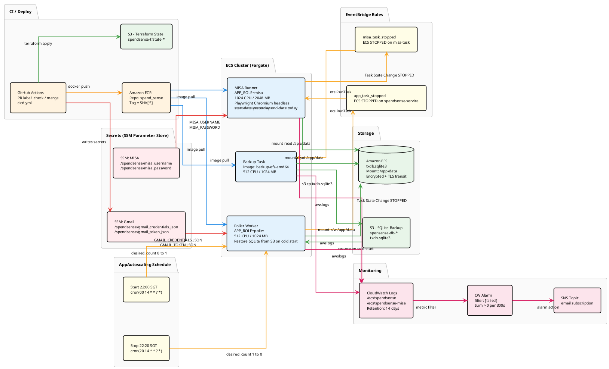
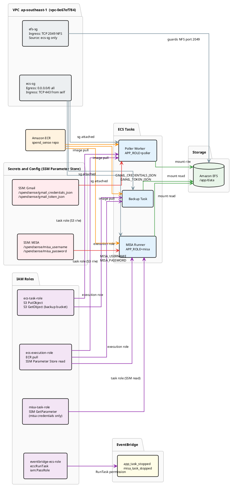

# Deployment Guide — SpendSense

SpendSense is deployed to **AWS** using **Terraform** for infrastructure and **GitHub Actions** for CI/CD. The infrastructure is defined in `deploy_1/`.

See also: [`deploy_1/ARCHITECTURE.md`](../deploy_1/ARCHITECTURE.md) for detailed Terraform resource descriptions.

---

## Infrastructure Overview

| Component | AWS Service |
|-----------|-------------|
| Container image registry | Amazon ECR |
| Container runtime | Amazon ECS (Fargate or EC2) |
| Secrets & Credentials | AWS Systems Manager (SSM) Parameter Store |
| Terraform remote state | Amazon S3 (`spendsense-tfstate-359615771071`) |
| Region | `ap-southeast-1` (Singapore) |

---

## Prerequisites

- AWS CLI configured with appropriate credentials
- Terraform 1.9.0+ installed
- Docker installed (for image builds)
- S3 backend bucket already bootstrapped (run once: `scripts/tf_backend_bootstrap.sh`)

---

## Bootstrap (First Time Only)

Run the S3 backend bootstrap script once before the first Terraform deployment:

```bash
bash scripts/tf_backend_bootstrap.sh
```

This creates:
- The S3 bucket for Terraform state (`spendsense-tfstate-359615771071`)
- DynamoDB table for state locking (if used)

---

## Manual Deployment

If you need to deploy manually (outside of GitHub Actions):

### 1. Build and push Docker image to ECR

```bash
IMAGE_TAG=<your-tag>
AWS_ACCOUNT=359615771071
AWS_REGION=ap-southeast-1
ECR_REPO=$AWS_ACCOUNT.dkr.ecr.$AWS_REGION.amazonaws.com/spend_sense

# Login to ECR
aws ecr get-login-password --region $AWS_REGION \
  | docker login --username AWS --password-stdin $AWS_ACCOUNT.dkr.ecr.$AWS_REGION.amazonaws.com

# Build and push
docker build -t spend_sense:$IMAGE_TAG .
docker tag spend_sense:$IMAGE_TAG $ECR_REPO:$IMAGE_TAG
docker push $ECR_REPO:$IMAGE_TAG
```

### 2. Apply Terraform

```bash
cd deploy_1

# Initialize (connects to S3 remote state)
terraform init

# Plan with the new image tag
terraform plan -var="app_image_tag=$IMAGE_TAG"

# Apply
terraform apply -var="app_image_tag=$IMAGE_TAG" -auto-approve
```

---

## Secrets Setup

All secrets are stored in **AWS Systems Manager (SSM) Parameter Store** as `SecureString` parameters (encrypted at rest with KMS) to stay 100% within the free tier.

### Gmail credentials (SSM Parameter Store)

The GitHub Actions CI/CD pipeline reads Gmail credentials from GitHub Secrets and passes them to Terraform as `TF_VAR_*`. Terraform stores them in AWS SSM Parameter Store as `SecureString`.

| Terraform variable | AWS SSM Parameter name | Type |
|-------------------|------------------------|------|
| `TF_VAR_gmail_credentials_json` | `/spendsense/gmail_credentials_json` | `SecureString` |
| `TF_VAR_gmail_token_json` | `/spendsense/gmail_token_json` | `SecureString` |

### MISA credentials (SSM Parameter Store)

| SSM Parameter | Description |
|---------------|-------------|
| `/spendsense/misa_username` | MISA login email |
| `/spendsense/misa_password` | MISA login password |

To set them manually:
```bash
aws ssm put-parameter \
  --name /spendsense/misa_username \
  --value "your@email.com" \
  --type SecureString \
  --region ap-southeast-1

aws ssm put-parameter \
  --name /spendsense/misa_password \
  --value "your_password" \
  --type SecureString \
  --region ap-southeast-1
```

---

## Terraform Files (`deploy_1/`)

| File | Purpose |
|------|---------|
| `main.tf` | Core infrastructure (ECR, ECS, VPC, IAM, SSM Parameter Store) |
| `misa_runner.tf` | MISA runner ECS task definition and scheduled job |
| `variables.tf` | Input variables |
| `outputs.tf` | Output values (e.g. ECR repo URL) |
| `backend.tf` | S3 remote state configuration |
| `terraform.tfvars.example` | Example variable values |

---

## Terraform Remote State

```hcl
# deploy_1/backend.tf
terraform {
  backend "s3" {
    bucket = "spendsense-tfstate-359615771071"
    key    = "spendsense/terraform.tfstate"
    region = "ap-southeast-1"
  }
}
```

> ⚠️ The state lock is managed via S3 object versioning. If a deployment fails and the lock is stuck, check S3 for the state file version and resolve manually.

---

## IAM Permissions Required

The deploying IAM user/role needs:

```
ecr:GetAuthorizationToken
ecr:BatchCheckLayerAvailability
ecr:PutImage / ecr:InitiateLayerUpload / ecr:UploadLayerPart / ecr:CompleteLayerUpload
ecs:RegisterTaskDefinition / ecs:UpdateService / ecs:DescribeServices
secretsmanager:CreateSecret / secretsmanager:UpdateSecret / secretsmanager:DescribeSecret
ssm:PutParameter / ssm:GetParameter / ssm:DescribeParameters
s3:GetObject / s3:PutObject (on tfstate bucket)
sts:GetCallerIdentity
```

---

## Rollback

To rollback to a previous image tag:

```bash
cd deploy_1
terraform apply -var="app_image_tag=<previous-tag>" -auto-approve
```

Or restore the previous Terraform state from S3 versioning if the state itself was corrupted.

---

## Automated CI/CD

The preferred way to deploy is via the **`merge` label** on GitHub. See [`docs/CICD.md`](CICD.md) for the full pipeline documentation.

---

## AWS Resource Diagram

> Rendered with any PlantUML viewer — IntelliJ plugin, VS Code PlantUML extension, or [plantuml.com](https://www.plantuml.com/plantuml/uml/).

### Diagram 1 — Main Flow (Task Chain)



---

### Diagram 2 — Security and IAM


